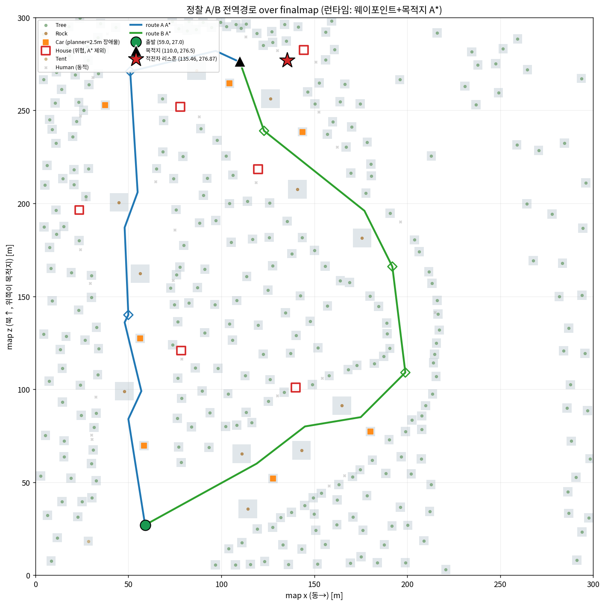
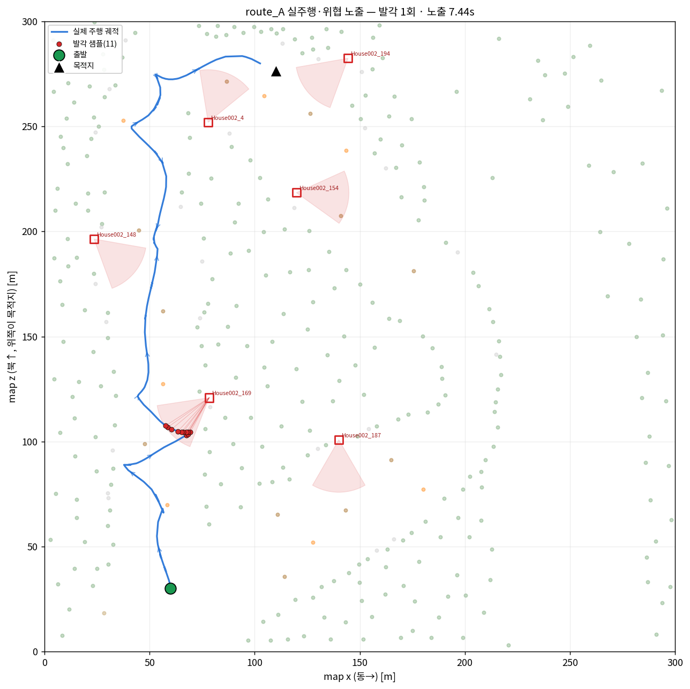
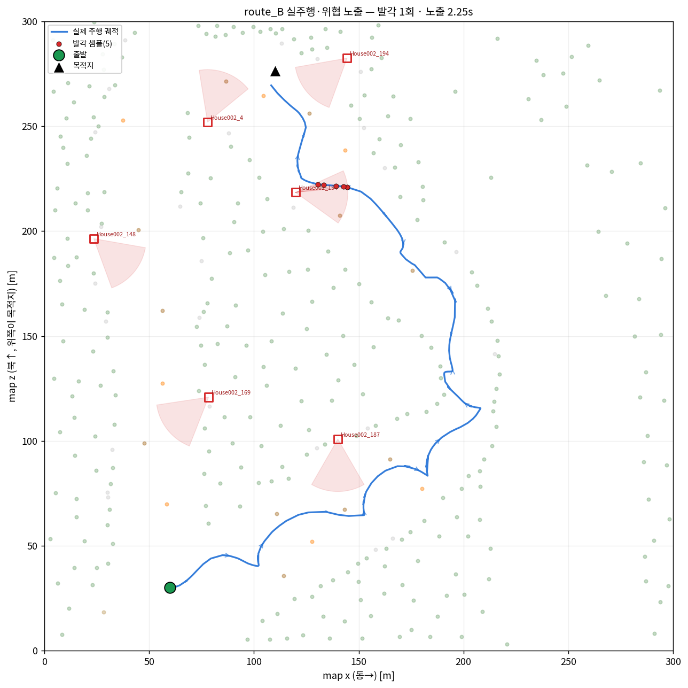

# 전차 시뮬레이터 자율주행 ROS2 워크스페이스

> Unity 전차 시뮬레이터의 **자율주행**과, 정찰 경로 **A vs B의 은밀성·위험도 정량 평가**를 위한 ROS2 워크스페이스.


시뮬레이터는 **별도 Windows PC**에서 돌아가며, DDS가 아니라 **HTTP(Flask 브릿지)** 로 이 워크스페이스와 통신한다.
목표는 단순 A→B 주행이 아니라 **위협 회피·험지 돌파**, 그리고 **정찰 경로(A/B)의 은밀성/위험도 정량 평가**다.



---

## 목차
- [프로젝트 개요](#프로젝트-개요)
- [핵심 기능](#핵심-기능)
- [시스템 아키텍처](#시스템-아키텍처)
- [시작하기](#시작하기)
- [실행](#실행)
- [정찰 시나리오 & 산출물](#정찰-시나리오--산출물)
- [현재 진행 상황 & 로드맵](#현재-진행-상황--로드맵)
- [프로젝트 구조](#프로젝트-구조)
- [문서](#문서)
- [라이선스](#라이선스)

---

## 프로젝트 개요

| | |
|---|---|
| **무엇** | Unity 전차 시뮬레이터(별도 Windows PC)의 자율주행 ROS2 스택. |
| **통신** | DDS가 아닌 **HTTP(Flask) 브릿지** — 시뮬이 `/info`·`/detect`를 POST하고 `/get_action`으로 제어(W/A/S/D)를 받아간다. |
| **목표** | ① 위협 회피·험지 돌파 자율주행, ② **정찰 경로 A/B의 은밀성·위험도 정량 평가**(노출도·시선차단·위협 반경 기반). |
| **특징** | 시뮬→브릿지→인지→판단→회피→제어→브릿지로 닫히는 **폐루프**. 8+개 ROS2 패키지가 협력. |

> 시뮬↔브릿지 목적지 채널은 **단방향**이다(시뮬이 자기 목적지를 브릿지로 POST할 뿐, ROS→시뮬 리셋 경로 없음).
> 그래서 정찰 A→B 사이에는 시뮬을 **수동으로 재시작**하고, 도착/종료 판정은 ROS 쪽 pose + `route_*.json`으로 한다.

---

## 핵심 기능

- **인지** — LiDAR 지형/장애물 분리(0.5m 격자 높이차), DBSCAN 클러스터링, 카메라–LiDAR 융합, YOLO 5클래스(`car/person/tank/rock/house`).
- **판단** — A* 전역경로 + 비동기 재탐색, FOV콘·시선차단(LoS)·타입별 위협 반경(House 25m / Tank 20m).
- **회피** — APF 국소 회피(목적지 인력 + 장애물 척력 + 접선력 + 위협 척력).
- **제어** — PD(비례+rate feedback) 헤딩 제어 → W/A/S/D, 끼임 탈출, 순간이동/재시작 감지.
- **정찰** — A/B 루트 주행·로깅 → 위험도·은밀성 **비교 보고서** + 루트 추천.
- **LLM** — 로컬 LLM(ollama)으로 정찰 루트 위험도·은밀성 평가 → 콕핏 MFD(웹)에 전술조언 표시.
- **지형** — 주행 중 지면/장애물 점 누적 → 격자 **고도·거칠기 지형맵** 생성·저장.

---

## 시스템 아키텍처

```text
        ┌──────────────────────────────────────────────────────────┐
        │            Unity 전차 시뮬레이터 (Windows PC)              │
        └──────────────┬───────────────────────────▲───────────────┘
            HTTP POST   │ /info, /detect            │ /get_action (W/A/S/D)
                        ▼                           │
                   ┌─────────┐                 ┌─────────┐
                   │ros_bridge│  ───────────▶  │ros_bridge│
                   └────┬────┘   (제어 하달)    └────▲────┘
                        ▼                           │
   인지  lidar · vision · tank_visual_perception    │
                        ▼                           │
   판단  path_planning (A* 전역경로)                 │
                        ▼                           │
   회피  potential (APF 국소회피)                    │
                        ▼                           │
   제어  control (PD 헤딩) ───────────────────────────┘
```

상세 토픽 흐름은 **[docs/README_REORGANIZED_STRUCTURE.md](docs/README_REORGANIZED_STRUCTURE.md)**,
시뮬 HTTP 규약은 **[docs/SIMULATOR_API.md](docs/SIMULATOR_API.md)** 참고.

### 패키지 구성 (`src/`)

| 패키지 | 책임 |
|---|---|
| `ros_bridge` | 시뮬 HTTP(`/info`·`/detect`·`/get_action`) ↔ ROS2 토픽 중계 Flask 서버, W/A/S/D 하달, 콕핏 MFD(웹). |
| `lidar` | raw LiDAR 파싱·좌표 변환·`/tank/sensor/lidar/*` 생성을 **유일하게** 담당. 0.5m 격자로 지형/장애물 분리. |
| `vision` | YOLO 추론(5클래스). 모델 `best_final.pt`. 식별은 지도좌표(`tank_map`) 기반. |
| `tank_visual_perception` | DBSCAN 클러스터링(eps=1.5) + LiDAR↔카메라 투영·융합. |
| `path_planning` | A* 전역경로 + 비동기 재탐색; 카메라/LiDAR 융합·발견객체 맵; **정찰 로깅**; 루트 A/B(`routes.yaml`). |
| `potential` | APF 국소 회피(인력+척력+접선력+위협 척력). |
| `control` | PD 헤딩 제어 → W/A/S/D, 끼임 탈출, 순간이동/재시작 감지. |
| `ground_division` | 주행 중 지면/장애물 점 누적 → `finalize` 시 voxel 압축 + 고도·거칠기 지형맵 저장. |
| `risk_analysis` | 로컬 LLM(ollama)으로 정찰 A/B 루트 위험도·은밀성 평가 → `/tank/risk/route_report`. |
| `tank_common` | 패키지 공용 헬퍼 단일 출처(`pointcloud2_to_xyz_array` 등). |
| `rviz_visualization` | 경로/클러스터/힘 벡터 RViz2 마커, 정적 맵 로더. |

---

## 시작하기

### 요구사항
- **ROS2 Humble** (ament_python, colcon)
- **Python 3.10** — `numpy`, `opencv-python`, `torch`, `ultralytics`(YOLO), `scikit-learn`, `flask`, `PyYAML`
- **ollama** (선택, LLM 루트 위험도용) — 로컬 `http://localhost:11434`
- **Unity 전차 시뮬레이터** (별도 Windows PC)

### 빌드
```bash
# 워크스페이스 루트에서. symlink-install로 파이썬은 재빌드 없이 수정 반영.
colcon build --symlink-install
source install/setup.bash      # ros2 run/launch 전에 새 터미널마다 필수
```

### 설정
브릿지 기본값은 `.env`에 둔다(gitignore — 비밀값/IP는 여기에). 키 템플릿은 [`.env.example`](.env.example) 참고.

| 키 | 설명 |
|---|---|
| `TANK_MODE` | `monitor`(수동) / `auto`(ROS 자율주행) |
| `TANK_BRIDGE_HOST`·`TANK_BRIDGE_PORT` | Flask 바인딩 주소/포트(기본 `0.0.0.0:5000`) |
| `TANK_ALLOWED_CLIENTS` | 접속 허용 IP — **마지막에 시뮬 PC 실제 IP** 추가 |
| `TANK_YOLO_MODEL_PATH` | YOLO 가중치 경로(`best_final.pt`) |

> **ROS 그래프 격리**: 같은 LAN에서 팀원도 ROS2를 띄우면 노드가 섞인다(전차 순간이동 등).
> `~/.bashrc`에 `export ROS_LOCALHOST_ONLY=1` + `export ROS_DOMAIN_ID=42`(고유값)를 박고 `ros2 daemon stop`.

---

## 실행

**실행 순서가 중요하다.** 브릿지를 `auto`로 **먼저** 띄운 뒤 시뮬을 (재)시작해야 `/init` 핸드셰이크가 닿는다.

```bash
# 터미널 1 — HTTP 브릿지(Flask). 시뮬 PC 실제 IP 입력.
TANK_ALLOWED_CLIENTS=127.0.0.1,::1,<시뮬PC_IP> TANK_MODE=auto ros2 run ros_bridge ros_bridge

# 터미널 2 — (Windows) 시뮬레이터 시작/재시작 → /init 핸드셰이크

# 터미널 3 — 전체 자율주행 스택(lidar + 인지 + A* + APF + 컨트롤러를 launch 하나로)
ros2 launch control tank_autonomous_control.launch.py mission_type:=recon route_id:=A route_side:=west

# 터미널 4 — RViz (선택)
ros2 launch rviz_visualization tank_rviz.launch.py
```

`tank_autonomous_control.launch.py`가 런타임 스택과 **모든 노드 파라미터**의 단일 출처다.
인자: `mission_type` ∈ {recon, mission, return}, `route_id` ∈ {A, B}, `route_side` ∈ {west, east}.

<details>
<summary>개별 노드 수동 실행 (디버깅용)</summary>

```bash
ros2 run lidar lidar_processor_node
ros2 run tank_visual_perception lidar_dbscan_cluster_node
ros2 run path_planning local_path_node
# ... 엔트리포인트는 각 패키지 setup.py 참고
```
</details>

---

## 정찰 시나리오 & 산출물

```bash
source install/setup.bash
python3 scripts/run_recon_scenario.py
```

A 루트 주행 → 도착 감지 → **시뮬 수동 재시작 안내** → 출발지 복귀 감지 → B 루트 주행 →
`recon_reports/`에 `route_A.json`·`route_B.json`·`comparison.json` 생성.

비교 보고서·시각화:
```bash
python3 scripts/generate_recon_report.py   # → recon_reports/recon_report.md (A/B 위험도·은밀성 + 루트 추천)
python3 scripts/verify_route_plan.py        # 시뮬 없이 루트 품질 검증(--derive로 도출)
```

루트별 **노출도**(초소 시야 범위) 비교 — 정찰 평가의 핵심 산출물:

| 루트 A | 루트 B |
|---|---|
|  |  |

| 스크립트 | 용도 |
|---|---|
| `scripts/run_recon_scenario.py` | 정찰 A→B 자동 시퀀스 관리(도착 감지·재시작 안내·비교 생성) |
| `scripts/generate_recon_report.py` | A/B 위험도·은밀성 비교 보고서(시뮬 없이 단독 실행) |
| `scripts/verify_route_plan.py` | 루트 정적 검증/도출(나무 관통·코리더 이탈·웨이포인트 skip) |
| `scripts/visualize_routes.py` | 맵 위 A/B 전역경로 PNG 렌더 |
| `scripts/analyze_run.py` | 주행 추종오차를 코너컷/직선이탈/제어로 분해 진단 |
| `scripts/make_llm_input.py` | `comparison.json` → LLM 비교 입력 생성 |

> **지형맵**: 자율주행 스택과 별도로 `ros2 launch rviz_visualization tank_rviz.launch.py`(지형 기록 노드 포함)를
> 띄워 주행 중 점을 누적하고, 끝에 `ros2 service call /tank/terrain/finalize_map std_srvs/srv/Trigger "{}"`로
> `recon_reports/terrain_maps/`에 저장한다(수동 finalize).

---

## 현재 진행 상황 & 로드맵

### ✅ 동작
- **인지** — 지형/장애물 분리, DBSCAN, 카메라-LiDAR 융합, YOLO 5클래스
- **판단/회피** — A* 전역 + APF 국소 + FOV콘·시선차단·타입별 위협 반경
- **제어** — PD 헤딩 + 끼임 탈출 *(완전 PID 아님)*
- **브릿지** — HTTP ↔ ROS2 중계 + 콕핏 MFD(웹)
- **정찰** — A/B 루트 로깅·비교 보고서·노출/위험도 시각화
- **LLM** — 로컬 ollama 루트 위험도 + MFD 전술조언 표시
- **지형** — 주행 중 누적 → 고도·거칠기 지형맵 기록
- **리팩토링 Phase A·B** — 주석 한글 통일, `tank_common` 공용 패키지로 중복 함수 단일출처화, terrain 노드 단일출처화

### 🚧 진행 중
- **지형분석 활용 결정** — A* 코스트 레이어 vs 위험도/LLM 입력(회의 안건)
- **추종오차 개선** — `route_A`(서쪽 숲, 좁은 클리어런스) 충돌 多 → 제어 stuck-escape/추종 튜닝

### 📋 계획 (설계만)
- **시나리오2** — 사격(`fire` 발행 + 포탑 조준) · 복귀 레그(출발지/목적지 스와프)
- **위험도 수식 6장** — 정량 평가 공식화
- **LLM 주행 의사결정 연동**, **HILS**, **RL**
- **리팩토링 Phase C** — 비대 파일 모듈 분할(무테스트 환경이라 한 번에 한 파일 + 스모크)

> 리팩토링 단계 기준은 [docs/CONVENTIONS.md](docs/CONVENTIONS.md), 전차 동역학 식별 실험은
> [docs/EXPERIMENT_RESULTS_AND_PLAN.md](docs/EXPERIMENT_RESULTS_AND_PLAN.md) 참고.

---

## 프로젝트 구조

```text
tank_project/
├─ src/                     # 11개 ROS2 패키지(위 표 참고)
├─ scripts/                 # 정찰 시나리오·보고서·진단 스크립트
├─ docs/                    # 아키텍처·API·컨벤션·실험 문서 + images/
├─ recon_reports/           # 정찰 산출물(json·png·terrain_maps) — gitignore
├─ config/                  # 전차 파라미터 등
├─ .env                     # 브릿지 설정(gitignore) — .env.example 참고
└─ README.md
```

**브랜치 전략** — `develop`(코드 원본) ← `jun`(작업 브랜치). GitHub `RT-FINAL-2TEAM/TankSimulation`.

---

## 문서

| 문서 | 내용 |
|---|---|
| [docs/README_REORGANIZED_STRUCTURE.md](docs/README_REORGANIZED_STRUCTURE.md) | 패키지 구분 + 상세 토픽/데이터흐름 다이어그램 |
| [docs/SIMULATOR_API.md](docs/SIMULATOR_API.md) | 시뮬 HTTP API 명세(`/init`·`/info`·`/detect`·`/get_action`) |
| [docs/CONVENTIONS.md](docs/CONVENTIONS.md) | 코딩 컨벤션(주석 한국어 통일·네이밍·리팩토링 단계) |
| [docs/EXPERIMENT_RESULTS_AND_PLAN.md](docs/EXPERIMENT_RESULTS_AND_PLAN.md) | 전차 동역학 식별 실험(속도·회전·정지거리) |
| [docs/INTEGRATION_NOTES_VISUAL_PERCEPTION.md](docs/INTEGRATION_NOTES_VISUAL_PERCEPTION.md) | 비주얼 인지 통합 노트 |
| [docs/REFACTOR_NOTES_LIDAR_CONFIG.md](docs/REFACTOR_NOTES_LIDAR_CONFIG.md) | LiDAR 책임 분리·config 리팩토링 |
| [docs/implementation_plan.md](docs/implementation_plan.md) | 맵 동기화·검증 마일스톤 계획 |
| [src/ros_bridge/README.md](src/ros_bridge/README.md) · [src/rviz_visualization/README.md](src/rviz_visualization/README.md) · [src/potential/README_LECTURE_APF_UPDATE.md](src/potential/README_LECTURE_APF_UPDATE.md) | 패키지별 노트 |

---

## 라이선스

MIT (각 `package.xml` 기준). © RT-FINAL-2TEAM.
