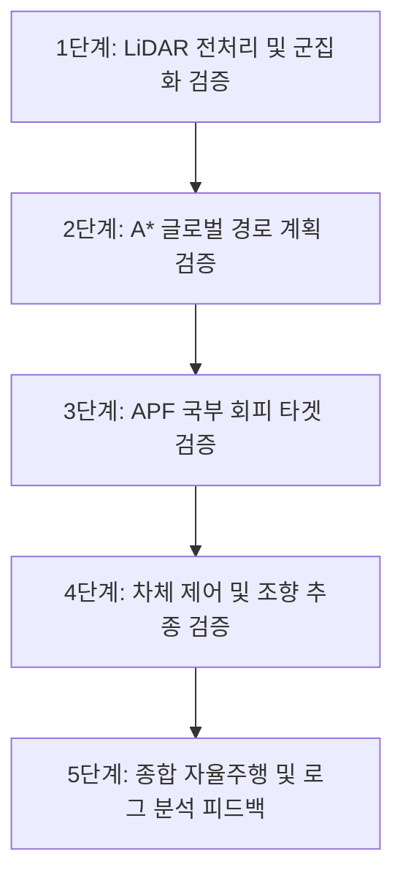

# 전차 시뮬레이터 연동 및 복합 모듈 검증 계획서

본 문서는 LiDAR 인지, 글로벌/로컬 경로 계획, APF 장애물 회피, 조향 제어가 복합적으로 얽혀 있는 연동 에러를 단계별로 격리하여 진단하고, 시뮬레이터와 ROS 간의 정적 맵 동기화 모순을 해결하기 위한 체계적인 마일스톤 및 데이터 분석 계획을 정의합니다.

또한, 분석 결과와 시각화 차트를 축적하는 전용 보고서 아카이브 디렉터리를 운영하여 개발 히스토리와 수정 근거를 명확하게 보존합니다.

## User Review Required

> [!IMPORTANT]
> **시뮬레이터 맵 로드 불일치 현상**
> 현재 RViz 상에서는 `static_map_loader_node`가 패키지에 내장된 정적 맵 파일(`recon_map.map`)을 파일에서 직접 로드하여 배포하고 있습니다. 시뮬레이터 측에서 맵을 로드하지 않은 상태에서도 RViz에는 맵이 나타나므로 주행 데이터가 왜곡됩니다. 이에 대해 동적 맵 동기화 구조를 개발해야 합니다.

> [!NOTE]
> **(폐기) 보고서 폴더(reports/)를 통한 성능 히스토리 누적** — `reports/`/`analyze_logs.py`는 제거되었다. 정찰 분석은 `recon_reports/` + `scripts/generate_recon_report.py`로 대체.

## Proposed Changes

---

### 1. 데이터 분석 및 시각화 보고서 축적 인프라 구축

> [!WARNING]
> **폐기됨(2026-06).** 이 절의 `scripts/analyze_logs.py` + `reports/` + `tank_logs/` JSONL 분석 경로는 한 번도 운용되지 않아 제거되었고, `TANK_SAVE_JSONL`은 기본 off로 전환되었다. 주행/정찰 분석은 `recon_reports/`(recon_logger 산출) + `scripts/generate_recon_report.py`(정찰 보고서 생성기)로 일원화한다. 아래 내용은 히스토리 보존용으로만 남긴다.

모듈 간 간섭과 복합 에러를 데이터 기반으로 격리 진단하고 히스토리를 관리하기 위한 아카이브 인프라를 구축합니다. ~~(`reports/` 아카이브 + `analyze_logs.py`)~~ — 폐기. `recon_reports/`로 대체.

---

### 2. 시뮬레이터와 ROS 간의 맵 동기화 해결 방안
시뮬레이터가 실제로 맵을 로드했는지 여부와 ROS2의 맵 데이터를 일치시키는 동적 동기화 메커니즘을 설계합니다.

#### [MODIFY] [static_map_loader_node.py](file:///c:/dev/rotem/tank_project/src/rviz_visualization/rviz_visualization/static_map_loader_node.py)
* 현재 파라미터 파일로 맵을 고정 로딩하는 구조에서 벗어나, `ros_bridge`가 수신한 `/init` 데이터의 `terrainIndex` 또는 맵 이름 정보를 바탕으로 적절한 `.map` 파일(예: `recon_map.map`, `mission_map.map`, `flat.map`)을 실시간으로 로드하여 퍼블리시하도록 노드를 확장합니다.
* 시뮬레이터 구동 중 실시간으로 생성/추가되는 장애물 데이터를 반영하기 위해 `/tank/map/obstacles` 토픽을 구독하여, 새로운 장애물이 추가될 때마다 백그라운드의 정적 지형 맵 위에 실시간 장애물을 덮어씌운 동적 `OccupancyGrid`를 재생성하여 퍼블리시하도록 개선합니다. 이를 통해 A* 경로 계획기 등의 모듈이 실시간 장애물을 회피할 수 있게 됩니다.

---

### 3. 모듈별 단계적 검증 및 디버깅 마일스톤

모듈이 복합적으로 얽혀 있으므로, 하위 모듈부터 상위 모듈 순서로 하나씩 검증하여 에러 발생 구역을 격리합니다.

* **1단계: LiDAR 인지 및 군집화 독립 검증**
  * 시뮬레이터 PC에서 탱크를 수동 주행하면서, RViz에 생성되는 `lidar_points` 및 DBSCAN 클러스터 마커들이 지형지물(나무, 바위 등)의 실제 물리적 크기/위치와 일치하여 찍히는지 센서 축 변환 정확도를 검증합니다.
* **2단계: A* 글로벌 경로 계획 검증**
  * `/set_destination`을 통해 목적지를 주었을 때, `map_astar_planner_node`가 장애물을 피해 가는 최단 글로벌 경로를 올바르게 실시간 생성하여 배포하는지 확인합니다.
* **3단계: APF 회피 타겟 검증**
  * 글로벌 타겟으로 인해 전차가 직진하려 할 때, 전방의 DBSCAN 장애물 클러스터로부터 안전 반발 벡터가 정상 작동하여 임시 우회 타겟 포즈가 생성되는지 검증합니다.
* **4단계: 제어 및 기동 신뢰성 검증**
  * APF가 지시하는 목표 지점을 따라 `tank_controller_node`가 과도 조종(오버스티어) 또는 조종 미달(언더스티어) 없이 선회 키 값을 시뮬레이터에 올바르게 전달하여 전차가 안정적으로 궤적을 그리는지 확인합니다.

## Verification Plan

### Automated Tests
* 정찰 A→B 주행 후 `python3 scripts/generate_recon_report.py`를 실행하여 `recon_reports/`의 route_A/B.json·comparison.json으로부터 A/B 위험도·은밀성 비교 보고서(`recon_report.md`)를 산출합니다. (구 `scripts/analyze_logs.py`는 폐기)

### Manual Verification
* 시뮬레이터 PC에서 맵 로딩 상태를 달리하여 `/init`을 수행하고, ROS2 단에서 맵 데이터가 그에 맞춰 동적으로 변경 로드되어 RViz 화면에 정합하게 반영되는지 직접 관측합니다.
