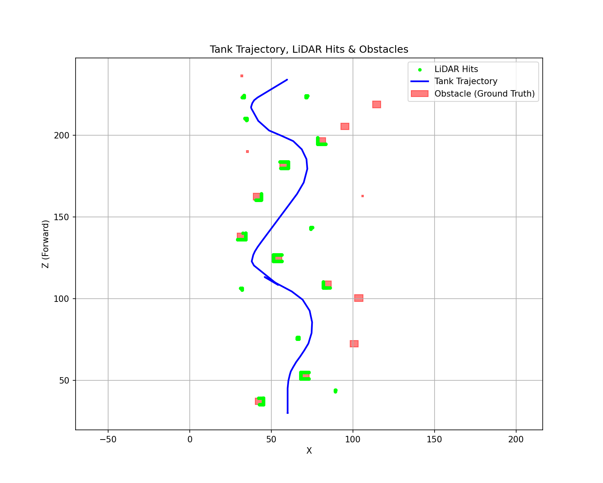

# 주행 분석 결과 보고서

- 생성일시: 2026-06-11 18:31:24
- 분석 대상 로그 세션: `session_20260611_092845`
- 사용된 맵: **평지 (수동 장애물 설치)**
- info 로그 개수: 67
- action 로그 개수: 0

## 1. 경로 및 장애물 인지 (Trajectory & LiDAR)

전차의 실제 주행 경로(파란 선)와 맵에 설치된 실제 장애물(빨간 박스), 그리고 라이다 센서가 인식한 표면(형광 초록색 점)입니다.
## 2. 장애물 인지 성능 수치 분석 (Metrics)
- **총 설치된 장애물 수:** 22개
- **성공적으로 인지된 장애물 수:** 15개 (인지율: 68.2%)
- **인지 실패(Missed) 장애물 수:** 7개

### 미인지 원인 분석
- 장애물 중심(100.8, 72.4): 탐지 거리 초과 (경로와의 최소 거리 26.9m > 라이다 사거리 15m)
- 장애물 중심(103.6, 100.3): 탐지 거리 초과 (경로와의 최소 거리 31.1m > 라이다 사거리 15m)
- 장애물 중심(114.5, 218.8): 탐지 거리 초과 (경로와의 최소 거리 53.4m > 라이다 사거리 15m)
- 장애물 중심(95.1, 205.4): 탐지 거리 초과 (경로와의 최소 거리 29.9m > 라이다 사거리 15m)
- 장애물 중심(105.9, 162.7): 탐지 거리 초과 (경로와의 최소 거리 37.0m > 라이다 사거리 15m)
- 장애물 중심(32.0, 236.3): 탐지 거리 초과 (경로와의 최소 거리 16.3m > 라이다 사거리 15m)
- 장애물 중심(35.3, 190.1): 탐지 거리 초과 (경로와의 최소 거리 18.5m > 라이다 사거리 15m)

