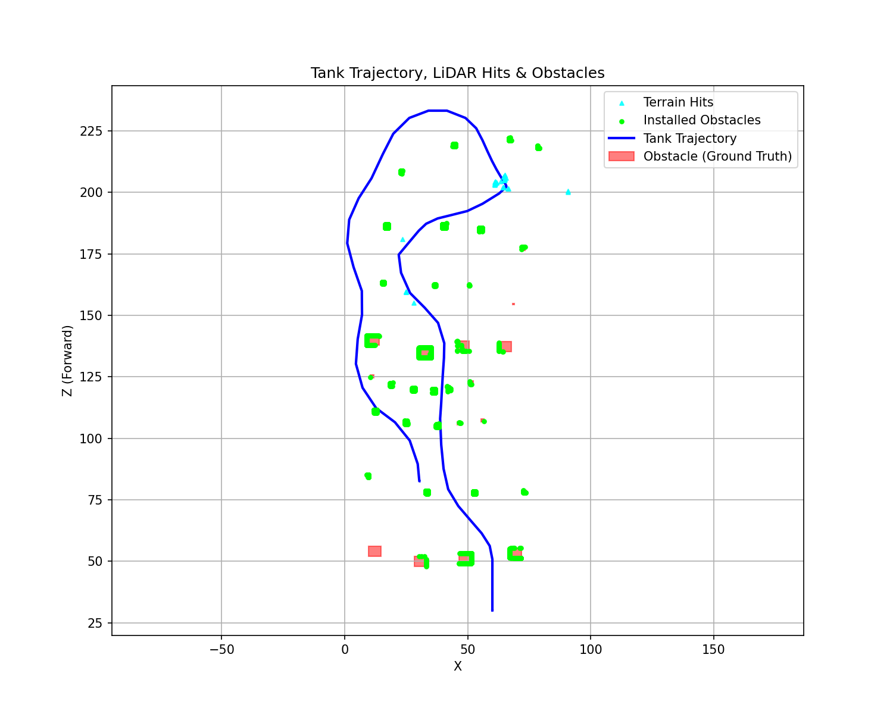

# 주행 분석 결과 보고서

- 생성일시: 2026-06-11 18:42:11
- 분석 대상 로그 세션: `session_20260611_093243`
- 사용된 맵: **험지 (수동 장애물 설치)**
- info 로그 개수: 89
- action 로그 개수: 0

## 1. 경로 및 장애물 인지 (Trajectory & LiDAR)

전차의 실제 주행 경로(파란 선)와 맵에 설치된 실제 장애물(빨간 박스), 그리고 라이다 센서가 인식한 표면입니다.
설치된 장애물 표면에 적중한 점은 **형광 초록색 동그라미(Lime)**로, 자연 지형지물(언덕/나무 등)에 적중한 점은 **하늘색 세모(Cyan)**로 구분하여 표시했습니다.

## 2. 장애물 인지 성능 수치 분석 (Metrics)
- **총 설치된 장애물 수:** 35개
- **성공적으로 인지된 장애물 수:** 33개 (인지율: 94.3%)
- **인지 실패(Missed) 장애물 수:** 2개

### 미인지 원인 분석
- 장애물 중심(12.2, 54.1): 탐지 거리 초과 (경로와의 최소 거리 33.8m > 라이다 사거리 15m)
- 장애물 중심(68.5, 154.6): 탐지 거리 초과 (경로와의 최소 거리 31.5m > 라이다 사거리 15m)

### 지형지물 vs 설치 장애물 구분 분석 (Terrain vs Dynamic Obstacles)
험지(울퉁불퉁한 지형) 테스트의 경우, 라이다가 인식한 전체 장애물 점 중에서 사용자가 설치한 장애물 외의 자연 지형지물(언덕, 나무, 바위 등)을 얼마나 인식했는지 수치화합니다.

- **전체 라이다 장애물 인지 점 개수:** 3499개
- **설치된 장애물(빨간 박스)에 적중한 점:** 3462개 (98.9%) - 형광 초록색(Lime)
- **자연 지형지물(험지/언덕 등)로 인식된 점:** 37개 (1.1%) - 하늘색 세모(Cyan)

> 💡 **분석 포인트:** 위 그래프에서 빨간 박스가 없는 곳에 찍힌 하늘색 세모 점들이 바로 '자연 지형지물'을 장애물로 정상 인식한 결과입니다. 지형지물 점의 비율을 통해 현재 맵의 험지(난이도) 수준 및 라이다의 지형 인지 능력을 확인할 수 있습니다.

