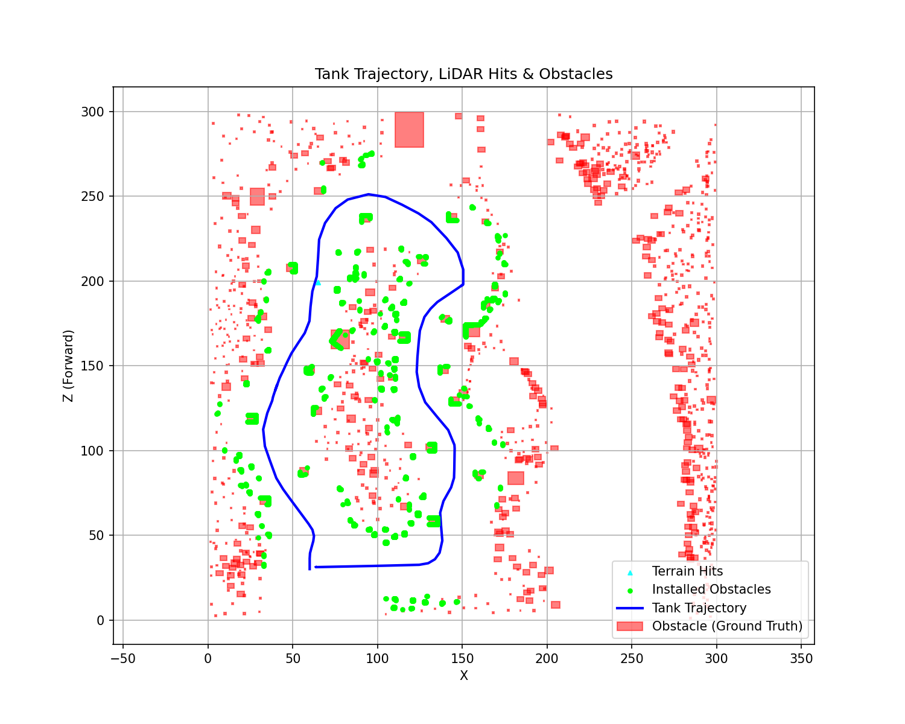

# 주행 분석 결과 보고서

- 생성일시: 2026-06-11 18:45:22
- 분석 대상 로그 세션: `session_20260611_094303`
- 사용된 맵: **정찰 지도 (recon_map)**
- info 로그 개수: 102
- action 로그 개수: 0

## 1. 경로 및 장애물 인지 (Trajectory & LiDAR)

전차의 실제 주행 경로(파란 선)와 맵에 설치된 실제 장애물(빨간 박스), 그리고 라이다 센서가 인식한 표면입니다.
설치된 장애물 표면에 적중한 점은 **형광 초록색 동그라미(Lime)**로, 자연 지형지물(언덕/나무 등)에 적중한 점은 **하늘색 세모(Cyan)**로 구분하여 표시했습니다.

## 2. 장애물 인지 성능 수치 분석 (Metrics)
- **총 설치된 장애물 수:** 1160개
- **성공적으로 인지된 장애물 수:** 158개 (인지율: 13.6%)
- **인지 실패(Missed) 장애물 수:** 1002개

### 미인지 원인 분석
- 장애물 중심(30.3, 4.8): 탐지 거리 초과 (경로와의 최소 거리 38.9m > 라이다 사거리 15m)
- 장애물 중심(31.0, 12.9): 탐지 거리 초과 (경로와의 최소 거리 33.7m > 라이다 사거리 15m)
- 장애물 중심(30.8, 24.3): 탐지 거리 초과 (경로와의 최소 거리 29.8m > 라이다 사거리 15m)
- 장애물 중심(33.9, 41.0): 탐지 거리 초과 (경로와의 최소 거리 26.4m > 라이다 사거리 15m)
- 장애물 중심(91.6, 58.7): 탐지 거리 초과 (경로와의 최소 거리 27.2m > 라이다 사거리 15m)
- 장애물 중심(100.0, 59.3): 탐지 거리 초과 (경로와의 최소 거리 27.6m > 라이다 사거리 15m)
- 장애물 중심(104.9, 3.5): 탐지 거리 초과 (경로와의 최소 거리 28.6m > 라이다 사거리 15m)
- 장애물 중심(102.8, 294.9): 탐지 거리 초과 (경로와의 최소 거리 44.5m > 라이다 사거리 15m)
- 장애물 중심(102.6, 287.3): 탐지 거리 초과 (경로와의 최소 거리 37.1m > 라이다 사거리 15m)
- 장애물 중심(101.9, 281.0): 탐지 거리 초과 (경로와의 최소 거리 30.8m > 라이다 사거리 15m)
- 장애물 중심(102.2, 273.4): 탐지 거리 초과 (경로와의 최소 거리 23.6m > 라이다 사거리 15m)
- 장애물 중심(143.5, 256.5): 탐지 거리 초과 (경로와의 최소 거리 24.8m > 라이다 사거리 15m)
- 장애물 중심(149.3, 256.2): 탐지 거리 초과 (경로와의 최소 거리 27.8m > 라이다 사거리 15m)
- 장애물 중심(154.7, 256.9): 탐지 거리 초과 (경로와의 최소 거리 31.9m > 라이다 사거리 15m)
- 장애물 중심(160.3, 260.7): 탐지 거리 초과 (경로와의 최소 거리 38.6m > 라이다 사거리 15m)
- 장애물 중심(161.1, 267.5): 탐지 거리 초과 (경로와의 최소 거리 44.0m > 라이다 사거리 15m)
- 장애물 중심(161.4, 277.4): 탐지 거리 초과 (경로와의 최소 거리 52.1m > 라이다 사거리 15m)
- 장애물 중심(160.8, 289.6): 탐지 거리 초과 (경로와의 최소 거리 61.8m > 라이다 사거리 15m)
- 장애물 중심(160.7, 296.0): 탐지 거리 초과 (경로와의 최소 거리 67.0m > 라이다 사거리 15m)
- 장애물 중심(155.2, 153.7): 탐지 거리 초과 (경로와의 최소 거리 31.7m > 라이다 사거리 15m)
- 장애물 중심(154.0, 147.8): 탐지 거리 초과 (경로와의 최소 거리 31.0m > 라이다 사거리 15m)
- 장애물 중심(152.8, 141.5): 탐지 거리 초과 (경로와의 최소 거리 27.8m > 라이다 사거리 15m)
- 장애물 중심(173.5, 110.9): 탐지 거리 초과 (경로와의 최소 거리 29.2m > 라이다 사거리 15m)
- 장애물 중심(178.7, 111.9): 탐지 거리 초과 (경로와의 최소 거리 34.4m > 라이다 사거리 15m)
- 장애물 중심(191.8, 132.0): 탐지 거리 초과 (경로와의 최소 거리 53.9m > 라이다 사거리 15m)
- 장애물 중심(180.5, 152.5): 탐지 거리 초과 (경로와의 최소 거리 54.4m > 라이다 사거리 15m)
- 장애물 중심(185.1, 147.6): 탐지 거리 초과 (경로와의 최소 거리 56.2m > 라이다 사거리 15m)
- 장애물 중심(189.2, 141.9): 탐지 거리 초과 (경로와의 최소 거리 56.1m > 라이다 사거리 15m)
- 장애물 중심(191.0, 136.6): 탐지 거리 초과 (경로와의 최소 거리 55.1m > 라이다 사거리 15m)
- 장애물 중심(194.4, 123.6): 탐지 거리 초과 (경로와의 최소 거리 53.1m > 라이다 사거리 15m)
- 장애물 중심(193.2, 118.1): 탐지 거리 초과 (경로와의 최소 거리 50.1m > 라이다 사거리 15m)
- 장애물 중심(185.8, 112.9): 탐지 거리 초과 (경로와의 최소 거리 41.6m > 라이다 사거리 15m)
- 장애물 중심(159.7, 159.5): 탐지 거리 초과 (경로와의 최소 거리 35.7m > 라이다 사거리 15m)
- 장애물 중심(168.8, 160.3): 탐지 거리 초과 (경로와의 최소 거리 41.3m > 라이다 사거리 15m)
- 장애물 중심(174.5, 159.3): 탐지 거리 초과 (경로와의 최소 거리 45.3m > 라이다 사거리 15m)
- 장애물 중심(163.8, 161.0): 탐지 거리 초과 (경로와의 최소 거리 37.9m > 라이다 사거리 15m)
- 장애물 중심(167.2, 57.6): 탐지 거리 초과 (경로와의 최소 거리 29.8m > 라이다 사거리 15m)
- 장애물 중심(64.1, 105.3): 탐지 거리 초과 (경로와의 최소 거리 29.8m > 라이다 사거리 15m)
- 장애물 중심(5.1, 110.8): 탐지 거리 초과 (경로와의 최소 거리 27.5m > 라이다 사거리 15m)
- 장애물 중심(86.3, 155.7): 탐지 거리 초과 (경로와의 최소 거리 32.2m > 라이다 사거리 15m)
- 장애물 중심(26.5, 151.4): 탐지 거리 초과 (경로와의 최소 거리 18.0m > 라이다 사거리 15m)
- 장애물 중심(28.2, 230.1): 탐지 거리 초과 (경로와의 최소 거리 37.8m > 라이다 사거리 15m)
- 장애물 중심(69.8, 94.9): 탐지 거리 초과 (경로와의 최소 거리 31.1m > 라이다 사거리 15m)
- 장애물 중심(10.9, 104.6): 탐지 거리 초과 (경로와의 최소 거리 22.7m > 라이다 사거리 15m)
- 장애물 중심(6.9, 132.0): 탐지 거리 초과 (경로와의 최소 거리 29.8m > 라이다 사거리 15m)
- 장애물 중심(11.4, 140.8): 탐지 거리 초과 (경로와의 최소 거리 28.5m > 라이다 사거리 15m)
- 장애물 중심(20.2, 146.7): 탐지 거리 초과 (경로와의 최소 거리 22.1m > 라이다 사거리 15m)
- 장애물 중심(5.1, 189.2): 탐지 거리 초과 (경로와의 최소 거리 54.5m > 라이다 사거리 15m)
- 장애물 중심(15.3, 185.3): 탐지 거리 초과 (경로와의 최소 거리 43.7m > 라이다 사거리 15m)
- 장애물 중심(19.2, 181.4): 탐지 거리 초과 (경로와의 최소 거리 38.5m > 라이다 사거리 15m)
- 장애물 중심(22.7, 176.7): 탐지 거리 초과 (경로와의 최소 거리 32.9m > 라이다 사거리 15m)
- 장애물 중심(24.9, 172.4): 탐지 거리 초과 (경로와의 최소 거리 28.7m > 라이다 사거리 15m)
- 장애물 중심(27.6, 167.6): 탐지 거리 초과 (경로와의 최소 거리 24.0m > 라이다 사거리 15m)
- 장애물 중심(23.0, 164.7): 탐지 거리 초과 (경로와의 최소 거리 26.8m > 라이다 사거리 15m)
- 장애물 중심(14.8, 159.2): 탐지 거리 초과 (경로와의 최소 거리 32.0m > 라이다 사거리 15m)
- 장애물 중심(4.5, 154.3): 탐지 거리 초과 (경로와의 최소 거리 39.5m > 라이다 사거리 15m)
- 장애물 중심(9.4, 155.4): 탐지 거리 초과 (경로와의 최소 거리 35.3m > 라이다 사거리 15m)
- 장애물 중심(17.8, 164.8): 탐지 거리 초과 (경로와의 최소 거리 31.6m > 라이다 사거리 15m)
- 장애물 중심(15.3, 175.8): 탐지 거리 초과 (경로와의 최소 거리 38.6m > 라이다 사거리 15m)
- 장애물 중심(17.4, 173.8): 탐지 거리 초과 (경로와의 최소 거리 35.9m > 라이다 사거리 15m)
- 장애물 중심(12.2, 185.1): 탐지 거리 초과 (경로와의 최소 거리 46.4m > 라이다 사거리 15m)
- 장애물 중심(12.5, 183.3): 탐지 거리 초과 (경로와의 최소 거리 45.0m > 라이다 사거리 15m)
- 장애물 중심(13.8, 180.3): 탐지 거리 초과 (경로와의 최소 거리 42.3m > 라이다 사거리 15m)
- 장애물 중심(16.1, 171.9): 탐지 거리 초과 (경로와의 최소 거리 36.2m > 라이다 사거리 15m)
- 장애물 중심(11.4, 168.3): 탐지 거리 초과 (경로와의 최소 거리 38.8m > 라이다 사거리 15m)
- 장애물 중심(12.4, 167.0): 탐지 거리 초과 (경로와의 최소 거리 37.4m > 라이다 사거리 15m)
- 장애물 중심(12.8, 164.3): 탐지 거리 초과 (경로와의 최소 거리 36.0m > 라이다 사거리 15m)
- 장애물 중심(5.4, 161.3): 탐지 거리 초과 (경로와의 최소 거리 41.3m > 라이다 사거리 15m)
- 장애물 중심(9.7, 163.6): 탐지 거리 초과 (경로와의 최소 거리 38.4m > 라이다 사거리 15m)
- 장애물 중심(8.8, 161.9): 탐지 거리 초과 (경로와의 최소 거리 38.6m > 라이다 사거리 15m)
- 장애물 중심(2.2, 171.1): 탐지 거리 초과 (경로와의 최소 거리 48.3m > 라이다 사거리 15m)
- 장애물 중심(2.8, 168.5): 탐지 거리 초과 (경로와의 최소 거리 46.8m > 라이다 사거리 15m)
- 장애물 중심(4.9, 174.5): 탐지 거리 초과 (경로와의 최소 거리 47.4m > 라이다 사거리 15m)
- 장애물 중심(6.9, 171.8): 탐지 거리 초과 (경로와의 최소 거리 44.4m > 라이다 사거리 15m)
- 장애물 중심(7.6, 172.4): 탐지 거리 초과 (경로와의 최소 거리 44.1m > 라이다 사거리 15m)
- 장애물 중심(7.3, 176.5): 탐지 거리 초과 (경로와의 최소 거리 46.1m > 라이다 사거리 15m)
- 장애물 중심(10.6, 176.9): 탐지 거리 초과 (경로와의 최소 거리 43.3m > 라이다 사거리 15m)
- 장애물 중심(5.4, 185.5): 탐지 거리 초과 (경로와의 최소 거리 52.2m > 라이다 사거리 15m)
- 장애물 중심(1.6, 183.2): 탐지 거리 초과 (경로와의 최소 거리 54.2m > 라이다 사거리 15m)
- 장애물 중심(6.6, 184.2): 탐지 거리 초과 (경로와의 최소 거리 50.5m > 라이다 사거리 15m)
- 장애물 중심(30.4, 155.1): 탐지 거리 초과 (경로와의 최소 거리 16.1m > 라이다 사거리 15m)
- 장애물 중심(76.5, 138.9): 탐지 거리 초과 (경로와의 최소 거리 32.6m > 라이다 사거리 15m)
- 장애물 중심(81.7, 145.8): 탐지 거리 초과 (경로와의 최소 거리 33.4m > 라이다 사거리 15m)
- 장애물 중심(29.5, 214.5): 탐지 거리 초과 (경로와의 최소 거리 35.5m > 라이다 사거리 15m)
- 장애물 중심(29.8, 208.2): 탐지 거리 초과 (경로와의 최소 거리 34.9m > 라이다 사거리 15m)
- 장애물 중심(42.7, 252.7): 탐지 거리 초과 (경로와의 최소 거리 32.2m > 라이다 사거리 15m)
- 장애물 중심(118.0, 74.1): 탐지 거리 초과 (경로와의 최소 거리 21.3m > 라이다 사거리 15m)
- 장애물 중심(124.3, 83.3): 탐지 거리 초과 (경로와의 최소 거리 19.7m > 라이다 사거리 15m)
- 장애물 중심(115.2, 109.9): 탐지 거리 초과 (경로와의 최소 거리 22.2m > 라이다 사거리 15m)
- 장애물 중심(175.6, 95.5): 탐지 거리 초과 (경로와의 최소 거리 30.2m > 라이다 사거리 15m)
- 장애물 중심(169.1, 50.2): 탐지 거리 초과 (경로와의 최소 거리 31.0m > 라이다 사거리 15m)
- 장애물 중심(171.9, 42.6): 탐지 거리 초과 (경로와의 최소 거리 33.9m > 라이다 사거리 15m)
- 장애물 중심(170.9, 35.8): 탐지 거리 초과 (경로와의 최소 거리 34.5m > 라이다 사거리 15m)
- 장애물 중심(123.7, 204.1): 탐지 거리 초과 (경로와의 최소 거리 20.2m > 라이다 사거리 15m)
- 장애물 중심(147.9, 249.3): 탐지 거리 초과 (경로와의 최소 거리 21.8m > 라이다 사거리 15m)
- 장애물 중심(172.1, 220.5): 탐지 거리 초과 (경로와의 최소 거리 25.0m > 라이다 사거리 15m)
- 장애물 중심(168.1, 204.6): 탐지 거리 초과 (경로와의 최소 거리 17.7m > 라이다 사거리 15m)
- 장애물 중심(118.8, 217.0): 탐지 거리 초과 (경로와의 최소 거리 21.9m > 라이다 사거리 15m)
- 장애물 중심(104.6, 218.6): 탐지 거리 초과 (경로와의 최소 거리 28.1m > 라이다 사거리 15m)
- 장애물 중심(77.8, 262.9): 탐지 거리 초과 (경로와의 최소 거리 15.7m > 라이다 사거리 15m)
- 장애물 중심(59.0, 269.3): 탐지 거리 초과 (경로와의 최소 거리 31.1m > 라이다 사거리 15m)
- 장애물 중심(46.8, 258.9): 탐지 거리 초과 (경로와의 최소 거리 32.7m > 라이다 사거리 15m)
- 장애물 중심(51.9, 265.8): 탐지 거리 초과 (경로와의 최소 거리 32.8m > 라이다 사거리 15m)
- 장애물 중심(72.1, 266.3): 탐지 거리 초과 (경로와의 최소 거리 21.1m > 라이다 사거리 15m)
- 장애물 중심(37.9, 249.8): 탐지 거리 초과 (경로와의 최소 거리 34.9m > 라이다 사거리 15m)
- 장애물 중심(95.8, 218.4): 탐지 거리 초과 (경로와의 최소 거리 30.8m > 라이다 사거리 15m)
- 장애물 중심(133.8, 6.6): 탐지 거리 초과 (경로와의 최소 거리 27.2m > 라이다 사거리 15m)
- 장애물 중심(138.3, 12.4): 탐지 거리 초과 (경로와의 최소 거리 22.7m > 라이다 사거리 15m)
- 장애물 중심(148.2, 13.4): 탐지 거리 초과 (경로와의 최소 거리 26.6m > 라이다 사거리 15m)
- 장애물 중심(158.0, 14.5): 탐지 거리 초과 (경로와의 최소 거리 32.2m > 라이다 사거리 15m)
- 장애물 중심(35.6, 171.2): 탐지 거리 초과 (경로와의 최소 거리 19.2m > 라이다 사거리 15m)
- 장애물 중심(81.7, 182.1): 탐지 거리 초과 (경로와의 최소 거리 21.4m > 라이다 사거리 15m)
- 장애물 중심(84.6, 176.7): 탐지 거리 초과 (경로와의 최소 거리 24.8m > 라이다 사거리 15m)
- 장애물 중심(85.6, 163.8): 탐지 거리 초과 (경로와의 최소 거리 28.6m > 라이다 사거리 15m)
- 장애물 중심(95.7, 193.1): 탐지 거리 초과 (경로와의 최소 거리 32.9m > 라이다 사거리 15m)
- 장애물 중심(98.1, 86.3): 탐지 거리 초과 (경로와의 최소 거리 43.9m > 라이다 사거리 15m)
- 장애물 중심(91.8, 91.9): 탐지 거리 초과 (경로와의 최소 거리 47.1m > 라이다 사거리 15m)
- 장애물 중심(96.3, 96.0): 탐지 거리 초과 (경로와의 최소 거리 45.4m > 라이다 사거리 15m)
- 장애물 중심(118.2, 103.3): 탐지 거리 초과 (경로와의 최소 거리 23.8m > 라이다 사거리 15m)
- 장애물 중심(3.7, 146.0): 탐지 거리 초과 (경로와의 최소 거리 37.4m > 라이다 사거리 15m)
- 장애물 중심(3.2, 139.7): 탐지 거리 초과 (경로와의 최소 거리 36.1m > 라이다 사거리 15m)
- 장애물 중심(12.4, 150.9): 탐지 거리 초과 (경로와의 최소 거리 30.9m > 라이다 사거리 15m)
- 장애물 중심(20.5, 155.4): 탐지 거리 초과 (경로와의 최소 거리 25.2m > 라이다 사거리 15m)
- 장애물 중심(31.8, 165.3): 탐지 거리 초과 (경로와의 최소 거리 19.2m > 라이다 사거리 15m)
- 장애물 중심(27.2, 159.1): 탐지 거리 초과 (경로와의 최소 거리 20.7m > 라이다 사거리 15m)
- 장애물 중심(5.1, 195.7): 탐지 거리 초과 (경로와의 최소 거리 56.5m > 라이다 사거리 15m)
- 장애물 중심(4.7, 205.3): 탐지 거리 초과 (경로와의 최소 거리 58.0m > 라이다 사거리 15m)
- 장애물 중심(28.3, 184.9): 탐지 거리 초과 (경로와의 최소 거리 32.2m > 라이다 사거리 15m)
- 장애물 중심(31.2, 195.2): 탐지 거리 초과 (경로와의 최소 거리 30.4m > 라이다 사거리 15m)
- 장애물 중심(24.0, 188.8): 탐지 거리 초과 (경로와의 최소 거리 36.8m > 라이다 사거리 15m)
- 장애물 중심(27.2, 199.6): 탐지 거리 초과 (경로와의 최소 거리 34.8m > 라이다 사거리 15m)
- 장애물 중심(22.9, 213.0): 탐지 거리 초과 (경로와의 최소 거리 42.0m > 라이다 사거리 15m)
- 장애물 중심(22.8, 205.9): 탐지 거리 초과 (경로와의 최소 거리 40.6m > 라이다 사거리 15m)
- 장애물 중심(17.9, 213.8): 탐지 거리 초과 (경로와의 최소 거리 47.1m > 라이다 사거리 15m)
- 장애물 중심(17.9, 206.7): 탐지 거리 초과 (경로와의 최소 거리 45.6m > 라이다 사거리 15m)
- 장애물 중심(15.0, 199.8): 탐지 거리 초과 (경로와의 최소 거리 47.0m > 라이다 사거리 15m)
- 장애물 중심(21.3, 196.9): 탐지 거리 초과 (경로와의 최소 거리 40.4m > 라이다 사거리 15m)
- 장애물 중심(13.2, 194.2): 탐지 거리 초과 (경로와의 최소 거리 48.2m > 라이다 사거리 15m)
- 장애물 중심(20.1, 192.5): 탐지 거리 초과 (경로와의 최소 거리 41.2m > 라이다 사거리 15m)
- 장애물 중심(4.1, 101.3): 탐지 거리 초과 (경로와의 최소 거리 29.5m > 라이다 사거리 15m)
- 장애물 중심(3.9, 83.6): 탐지 거리 초과 (경로와의 최소 거리 34.3m > 라이다 사거리 15m)
- 장애물 중심(4.6, 68.8): 탐지 거리 초과 (경로와의 최소 거리 38.7m > 라이다 사거리 15m)
- 장애물 중심(5.4, 53.0): 탐지 거리 초과 (경로와의 최소 거리 45.8m > 라이다 사거리 15m)
- 장애물 중심(16.2, 33.5): 탐지 거리 초과 (경로와의 최소 거리 43.8m > 라이다 사거리 15m)
- 장애물 중심(19.8, 26.8): 탐지 거리 초과 (경로와의 최소 거리 40.4m > 라이다 사거리 15m)
- 장애물 중심(13.6, 26.4): 탐지 거리 초과 (경로와의 최소 거리 46.6m > 라이다 사거리 15m)
- 장애물 중심(9.2, 36.5): 탐지 거리 초과 (경로와의 최소 거리 50.8m > 라이다 사거리 15m)
- 장애물 중심(21.6, 3.9): 탐지 거리 초과 (경로와의 최소 거리 46.5m > 라이다 사거리 15m)
- 장애물 중심(10.0, 3.7): 탐지 거리 초과 (경로와의 최소 거리 56.5m > 라이다 사거리 15m)
- 장애물 중심(21.4, 14.4): 탐지 거리 초과 (경로와의 최소 거리 41.7m > 라이다 사거리 15m)
- 장애물 중심(14.4, 9.6): 탐지 거리 초과 (경로와의 최소 거리 50.0m > 라이다 사거리 15m)
- 장애물 중심(4.5, 2.6): 탐지 거리 초과 (경로와의 최소 거리 61.9m > 라이다 사거리 15m)
- 장애물 중심(2.1, 9.3): 탐지 거리 초과 (경로와의 최소 거리 61.5m > 라이다 사거리 15m)
- 장애물 중심(11.9, 17.5): 탐지 거리 초과 (경로와의 최소 거리 49.7m > 라이다 사거리 15m)
- 장애물 중심(2.1, 31.4): 탐지 거리 초과 (경로와의 최소 거리 57.9m > 라이다 사거리 15m)
- 장애물 중심(3.6, 45.4): 탐지 거리 초과 (경로와의 최소 거리 51.7m > 라이다 사거리 15m)
- 장애물 중심(19.4, 40.7): 탐지 거리 초과 (경로와의 최소 거리 40.8m > 라이다 사거리 15m)
- 장애물 중심(10.8, 45.1): 탐지 거리 초과 (경로와의 최소 거리 46.0m > 라이다 사거리 15m)
- 장애물 중심(24.9, 47.6): 탐지 거리 초과 (경로와의 최소 거리 33.2m > 라이다 사거리 15m)
- 장애물 중심(9.4, 95.5): 탐지 거리 초과 (경로와의 최소 거리 25.1m > 라이다 사거리 15m)
- 장애물 중심(15.4, 87.9): 탐지 거리 초과 (경로와의 최소 거리 22.0m > 라이다 사거리 15m)
- 장애물 중심(12.5, 83.5): 탐지 거리 초과 (경로와의 최소 거리 26.2m > 라이다 사거리 15m)
- 장애물 중심(2.5, 75.5): 탐지 거리 초과 (경로와의 최소 거리 38.7m > 라이다 사거리 15m)
- 장애물 중심(9.2, 80.1): 탐지 거리 초과 (경로와의 최소 거리 30.7m > 라이다 사거리 15m)
- 장애물 중심(14.6, 74.4): 탐지 거리 초과 (경로와의 최소 거리 27.3m > 라이다 사거리 15m)
- 장애물 중심(9.5, 72.5): 탐지 거리 초과 (경로와의 최소 거리 32.8m > 라이다 사거리 15m)
- 장애물 중심(5.8, 58.3): 탐지 거리 초과 (경로와의 최소 거리 42.8m > 라이다 사거리 15m)
- 장애물 중심(13.7, 66.2): 탐지 거리 초과 (경로와의 최소 거리 31.8m > 라이다 사거리 15m)
- 장애물 중심(21.4, 62.9): 탐지 거리 초과 (경로와의 최소 거리 27.0m > 라이다 사거리 15m)
- 장애물 중심(13.9, 59.1): 탐지 거리 초과 (경로와의 최소 거리 35.3m > 라이다 사거리 15m)
- 장애물 중심(16.4, 47.3): 탐지 거리 초과 (경로와의 최소 거리 40.1m > 라이다 사거리 15m)
- 장애물 중심(21.2, 56.5): 탐지 거리 초과 (경로와의 최소 거리 30.9m > 라이다 사거리 15m)
- 장애물 중심(7.8, 115.6): 탐지 거리 초과 (경로와의 최소 거리 25.0m > 라이다 사거리 15m)
- 장애물 중심(88.3, 70.2): 탐지 거리 초과 (경로와의 최소 거리 31.6m > 라이다 사거리 15m)
- 장애물 중심(91.3, 79.5): 탐지 거리 초과 (경로와의 최소 거리 39.3m > 라이다 사거리 15m)
- 장애물 중심(97.9, 69.0): 탐지 거리 초과 (경로와의 최소 거리 37.2m > 라이다 사거리 15m)
- 장애물 중심(109.2, 77.1): 탐지 거리 초과 (경로와의 최소 거리 30.5m > 라이다 사거리 15m)
- 장애물 중심(108.2, 67.4): 탐지 거리 초과 (경로와의 최소 거리 29.0m > 라이다 사거리 15m)
- 장애물 중심(99.2, 77.3): 탐지 거리 초과 (경로와의 최소 거리 40.3m > 라이다 사거리 15m)
- 장애물 중심(88.7, 88.1): 탐지 거리 초과 (경로와의 최소 거리 42.4m > 라이다 사거리 15m)
- 장애물 중심(104.1, 94.3): 탐지 거리 초과 (경로와의 최소 거리 40.2m > 라이다 사거리 15m)
- 장애물 중심(107.4, 88.2): 탐지 거리 초과 (경로와의 최소 거리 36.3m > 라이다 사거리 15m)
- 장애물 중심(112.4, 80.8): 탐지 거리 초과 (경로와의 최소 거리 28.6m > 라이다 사거리 15m)
- 장애물 중심(113.7, 94.8): 탐지 거리 초과 (경로와의 최소 거리 31.8m > 라이다 사거리 15m)
- 장애물 중심(113.3, 89.3): 탐지 거리 초과 (경로와의 최소 거리 32.1m > 라이다 사거리 15m)
- 장애물 중심(79.3, 128.8): 탐지 거리 초과 (경로와의 최소 거리 39.4m > 라이다 사거리 15m)
- 장애물 중심(69.2, 114.1): 탐지 거리 초과 (경로와의 최소 거리 34.8m > 라이다 사거리 15m)
- 장애물 중심(73.2, 124.5): 탐지 거리 초과 (경로와의 최소 거리 35.3m > 라이다 사거리 15m)
- 장애물 중심(69.0, 107.9): 탐지 거리 초과 (경로와의 최소 거리 35.3m > 라이다 사거리 15m)
- 장애물 중심(70.4, 100.8): 탐지 거리 초과 (경로와의 최소 거리 34.5m > 라이다 사거리 15m)
- 장애물 중심(75.2, 118.4): 탐지 거리 초과 (경로와의 최소 거리 38.9m > 라이다 사거리 15m)
- 장애물 중심(76.6, 110.6): 탐지 거리 초과 (경로와의 최소 거리 43.0m > 라이다 사거리 15m)
- 장애물 중심(75.9, 104.7): 탐지 거리 초과 (경로와의 최소 거리 40.8m > 라이다 사거리 15m)
- 장애물 중심(82.7, 100.7): 탐지 거리 초과 (경로와의 최소 거리 45.0m > 라이다 사거리 15m)
- 장애물 중심(83.3, 109.8): 탐지 거리 초과 (경로와의 최소 거리 48.6m > 라이다 사거리 15m)
- 장애물 중심(88.6, 103.8): 탐지 거리 초과 (경로와의 최소 거리 46.6m > 라이다 사거리 15m)
- 장애물 중심(89.9, 97.2): 탐지 거리 초과 (경로와의 최소 거리 48.7m > 라이다 사거리 15m)
- 장애물 중심(96.0, 105.2): 탐지 거리 초과 (경로와의 최소 거리 39.6m > 라이다 사거리 15m)
- 장애물 중심(104.7, 102.6): 탐지 거리 초과 (경로와의 최소 거리 34.9m > 라이다 사거리 15m)
- 장애물 중심(89.0, 111.4): 탐지 거리 초과 (경로와의 최소 거리 42.7m > 라이다 사거리 15m)
- 장애물 중심(92.0, 118.2): 탐지 거리 초과 (경로와의 최소 거리 37.6m > 라이다 사거리 15m)
- 장애물 중심(87.3, 130.4): 탐지 거리 초과 (경로와의 최소 거리 38.0m > 라이다 사거리 15m)
- 장애물 중심(80.2, 133.6): 탐지 거리 초과 (경로와의 최소 거리 38.3m > 라이다 사거리 15m)
- 장애물 중심(102.6, 126.8): 탐지 거리 초과 (경로와의 최소 거리 24.4m > 라이다 사거리 15m)
- 장애물 중심(92.0, 145.0): 탐지 거리 초과 (경로와의 최소 거리 31.2m > 라이다 사거리 15m)
- 장애물 중심(94.4, 159.8): 탐지 거리 초과 (경로와의 최소 거리 29.5m > 라이다 사거리 15m)
- 장애물 중심(84.2, 150.8): 탐지 거리 초과 (경로와의 최소 거리 32.8m > 라이다 사거리 15m)
- 장애물 중심(109.9, 209.0): 탐지 거리 초과 (경로와의 최소 거리 33.2m > 라이다 사거리 15m)
- 장애물 중심(98.0, 209.6): 탐지 거리 초과 (경로와의 최소 거리 33.3m > 라이다 사거리 15m)
- 장애물 중심(98.2, 185.5): 탐지 거리 초과 (경로와의 최소 거리 30.2m > 라이다 사거리 15m)
- 장애물 중심(109.9, 203.9): 탐지 거리 초과 (경로와의 최소 거리 29.5m > 라이다 사거리 15m)
- 장애물 중심(90.7, 172.9): 탐지 거리 초과 (경로와의 최소 거리 31.0m > 라이다 사거리 15m)
- 장애물 중심(102.1, 177.7): 탐지 거리 초과 (경로와의 최소 거리 24.0m > 라이다 사거리 15m)
- 장애물 중심(101.0, 109.6): 탐지 거리 초과 (경로와의 최소 거리 33.0m > 라이다 사거리 15m)
- 장애물 중심(9.1, 285.5): 탐지 거리 초과 (경로와의 최소 거리 78.7m > 라이다 사거리 15m)
- 장애물 중심(78.8, 278.9): 탐지 거리 초과 (경로와의 최소 거리 31.2m > 라이다 사거리 15m)
- 장애물 중심(58.1, 294.3): 탐지 거리 초과 (경로와의 최소 거리 52.3m > 라이다 사거리 15m)
- 장애물 중심(53.4, 280.5): 탐지 거리 초과 (경로와의 최소 거리 43.5m > 라이다 사거리 15m)
- 장애물 중심(36.3, 291.9): 탐지 거리 초과 (경로와의 최소 거리 62.7m > 라이다 사거리 15m)
- 장애물 중심(8.2, 271.2): 탐지 거리 초과 (경로와의 최소 거리 71.3m > 라이다 사거리 15m)
- 장애물 중심(8.9, 257.8): 탐지 거리 초과 (경로와의 최소 거리 64.7m > 라이다 사거리 15m)
- 장애물 중심(8.0, 237.0): 탐지 거리 초과 (경로와의 최소 거리 58.9m > 라이다 사거리 15m)
- 장애물 중심(49.2, 293.8): 탐지 거리 초과 (경로와의 최소 거리 56.6m > 라이다 사거리 15m)
- 장애물 중심(48.5, 275.9): 탐지 거리 초과 (경로와의 최소 거리 42.5m > 라이다 사거리 15m)
- 장애물 중심(60.3, 278.9): 탐지 거리 초과 (경로와의 최소 거리 38.0m > 라이다 사거리 15m)
- 장애물 중심(62.3, 290.0): 탐지 거리 초과 (경로와의 최소 거리 46.6m > 라이다 사거리 15m)
- 장애물 중심(73.9, 274.6): 탐지 거리 초과 (경로와의 최소 거리 28.0m > 라이다 사거리 15m)
- 장애물 중심(92.2, 290.6): 탐지 거리 초과 (경로와의 최소 거리 39.6m > 라이다 사거리 15m)
- 장애물 중심(74.3, 292.8): 탐지 거리 초과 (경로와의 최소 거리 45.6m > 라이다 사거리 15m)
- 장애물 중심(82.3, 294.2): 탐지 거리 초과 (경로와의 최소 거리 44.8m > 라이다 사거리 15m)
- 장애물 중심(85.6, 280.6): 탐지 거리 초과 (경로와의 최소 거리 30.9m > 라이다 사거리 15m)
- 장애물 중심(92.1, 282.3): 탐지 거리 초과 (경로와의 최소 거리 31.3m > 라이다 사거리 15m)
- 장애물 중심(80.1, 272.0): 탐지 거리 초과 (경로와의 최소 거리 24.1m > 라이다 사거리 15m)
- 장애물 중심(64.9, 279.0): 탐지 거리 초과 (경로와의 최소 거리 35.7m > 라이다 사거리 15m)
- 장애물 중심(63.3, 286.7): 탐지 거리 초과 (경로와의 최소 거리 43.2m > 라이다 사거리 15m)
- 장애물 중심(55.7, 289.4): 탐지 거리 초과 (경로와의 최소 거리 49.3m > 라이다 사거리 15m)
- 장애물 중심(57.1, 275.4): 탐지 거리 초과 (경로와의 최소 거리 37.3m > 라이다 사거리 15m)
- 장애물 중심(11.1, 250.3): 탐지 거리 초과 (경로와의 최소 거리 60.1m > 라이다 사거리 15m)
- 장애물 중심(6.8, 220.3): 탐지 거리 초과 (경로와의 최소 거리 58.5m > 라이다 사거리 15m)
- 장애물 중심(37.6, 287.7): 탐지 거리 초과 (경로와의 최소 거리 58.6m > 라이다 사거리 15m)
- 장애물 중심(35.7, 283.1): 탐지 거리 초과 (경로와의 최소 거리 56.4m > 라이다 사거리 15m)
- 장애물 중심(38.0, 269.5): 탐지 거리 초과 (경로와의 최소 거리 45.9m > 라이다 사거리 15m)
- 장애물 중심(19.8, 254.5): 탐지 거리 초과 (경로와의 최소 거리 53.3m > 라이다 사거리 15m)
- 장애물 중심(17.5, 243.0): 탐지 거리 초과 (경로와의 최소 거리 51.5m > 라이다 사거리 15m)
- 장애물 중심(17.5, 262.2): 탐지 거리 초과 (경로와의 최소 거리 58.7m > 라이다 사거리 15m)
- 장애물 중심(34.6, 265.3): 탐지 거리 초과 (경로와의 최소 거리 46.5m > 라이다 사거리 15m)
- 장애물 중심(205.2, 8.9): 탐지 거리 초과 (경로와의 최소 거리 75.2m > 라이다 사거리 15m)
- 장애물 중심(201.2, 29.3): 탐지 거리 초과 (경로와의 최소 거리 65.3m > 라이다 사거리 15m)
- 장애물 중심(191.8, 32.5): 탐지 거리 초과 (경로와의 최소 거리 55.4m > 라이다 사거리 15m)
- 장애물 중심(184.4, 12.3): 탐지 거리 초과 (경로와의 최소 거리 55.0m > 라이다 사거리 15m)
- 장애물 중심(182.8, 29.7): 탐지 거리 초과 (경로와의 최소 거리 47.2m > 라이다 사거리 15m)
- 장애물 중심(177.1, 5.7): 탐지 거리 초과 (경로와의 최소 거리 52.6m > 라이다 사거리 15m)
- 장애물 중심(198.5, 18.6): 탐지 거리 초과 (경로와의 최소 거리 65.3m > 라이다 사거리 15m)
- 장애물 중심(189.6, 40.7): 탐지 거리 초과 (경로와의 최소 거리 51.7m > 라이다 사거리 15m)
- 장애물 중심(177.9, 24.1): 탐지 거리 초과 (경로와의 최소 거리 44.1m > 라이다 사거리 15m)
- 장애물 중심(192.3, 5.6): 탐지 거리 초과 (경로와의 최소 거리 65.3m > 라이다 사거리 15m)
- 장애물 중심(178.3, 15.2): 탐지 거리 초과 (경로와의 최소 거리 48.3m > 라이다 사거리 15m)
- 장애물 중심(186.3, 20.1): 탐지 거리 초과 (경로와의 최소 거리 53.4m > 라이다 사거리 15m)
- 장애물 중심(195.1, 37.2): 탐지 거리 초과 (경로와의 최소 거리 57.7m > 라이다 사거리 15m)
- 장애물 중심(198.1, 11.3): 탐지 거리 초과 (경로와의 최소 거리 67.7m > 라이다 사거리 15m)
- 장애물 중심(184.2, 5.5): 탐지 거리 초과 (경로와의 최소 거리 58.6m > 라이다 사거리 15m)
- 장애물 중심(199.6, 104.8): 탐지 거리 초과 (경로와의 최소 거리 54.2m > 라이다 사거리 15m)
- 장애물 중심(170.6, 173.3): 탐지 거리 초과 (경로와의 최소 거리 31.7m > 라이다 사거리 15m)
- 장애물 중심(183.3, 188.6): 탐지 거리 초과 (경로와의 최소 거리 34.1m > 라이다 사거리 15m)
- 장애물 중심(174.0, 59.1): 탐지 거리 초과 (경로와의 최소 거리 36.0m > 라이다 사거리 15m)
- 장애물 중심(178.2, 71.3): 탐지 거리 초과 (경로와의 최소 거리 35.4m > 라이다 사거리 15m)
- 장애물 중심(197.8, 93.0): 탐지 거리 초과 (경로와의 최소 거리 52.4m > 라이다 사거리 15m)
- 장애물 중심(191.5, 106.2): 탐지 거리 초과 (경로와의 최소 거리 46.2m > 라이다 사거리 15m)
- 장애물 중심(181.5, 104.9): 탐지 거리 초과 (경로와의 최소 거리 36.2m > 라이다 사거리 15m)
- 장애물 중심(186.3, 99.3): 탐지 거리 초과 (경로와의 최소 거리 40.8m > 라이다 사거리 15m)
- 장애물 중심(166.9, 168.0): 탐지 거리 초과 (경로와의 최소 거리 33.8m > 라이다 사거리 15m)
- 장애물 중심(174.2, 185.6): 탐지 거리 초과 (경로와의 최소 거리 26.6m > 라이다 사거리 15m)
- 장애물 중심(164.9, 241.7): 탐지 거리 초과 (경로와의 최소 거리 29.3m > 라이다 사거리 15m)
- 장애물 중심(158.4, 253.4): 탐지 거리 초과 (경로와의 최소 거리 32.6m > 라이다 사거리 15m)
- 장애물 중심(169.6, 27.3): 탐지 거리 초과 (경로와의 최소 거리 35.2m > 라이다 사거리 15m)
- 장애물 중심(142.3, 4.6): 탐지 거리 초과 (경로와의 최소 거리 31.5m > 라이다 사거리 15m)
- 장애물 중심(126.1, 5.4): 탐지 거리 초과 (경로와의 최소 거리 27.2m > 라이다 사거리 15m)
- 장애물 중심(17.6, 229.1): 탐지 거리 초과 (경로와의 최소 거리 48.2m > 라이다 사거리 15m)
- 장애물 중심(23.4, 239.5): 탐지 거리 초과 (경로와의 최소 거리 44.8m > 라이다 사거리 15m)
- 장애물 중심(35.9, 256.7): 탐지 거리 초과 (경로와의 최소 거리 40.1m > 라이다 사거리 15m)
- 장애물 중심(183.5, 70.2): 탐지 거리 초과 (경로와의 최소 거리 40.7m > 라이다 사거리 15m)
- 장애물 중심(161.4, 249.0): 탐지 거리 초과 (경로와의 최소 거리 31.6m > 라이다 사거리 15m)
- 장애물 중심(167.3, 238.9): 탐지 거리 초과 (경로와의 최소 거리 29.9m > 라이다 사거리 15m)
- 장애물 중심(170.8, 233.6): 탐지 거리 초과 (경로와의 최소 거리 28.9m > 라이다 사거리 15m)
- 장애물 중심(177.2, 219.9): 탐지 거리 초과 (경로와의 최소 거리 29.7m > 라이다 사거리 15m)
- 장애물 중심(178.9, 205.7): 탐지 거리 초과 (경로와의 최소 거리 28.3m > 라이다 사거리 15m)
- 장애물 중심(172.8, 204.0): 탐지 거리 초과 (경로와의 최소 거리 22.4m > 라이다 사거리 15m)
- 장애물 중심(162.0, 256.3): 탐지 거리 초과 (경로와의 최소 거리 37.2m > 라이다 사거리 15m)
- 장애물 중심(99.7, 199.7): 탐지 거리 초과 (경로와의 최소 거리 35.0m > 라이다 사거리 15m)
- 장애물 중심(197.8, 132.4): 탐지 거리 초과 (경로와의 최소 거리 59.7m > 라이다 사거리 15m)
- 장애물 중심(202.5, 124.6): 탐지 거리 초과 (경로와의 최소 거리 61.0m > 라이다 사거리 15m)
- 장애물 중심(202.6, 116.4): 탐지 거리 초과 (경로와의 최소 거리 58.7m > 라이다 사거리 15m)
- 장애물 중심(192.6, 101.1): 탐지 거리 초과 (경로와의 최소 거리 47.1m > 라이다 사거리 15m)
- 장애물 중심(200.1, 98.6): 탐지 거리 초과 (경로와의 최소 거리 54.7m > 라이다 사거리 15m)
- 장애물 중심(227.9, 291.6): 탐지 거리 초과 (경로와의 최소 거리 109.6m > 라이다 사거리 15m)
- 장애물 중심(218.1, 288.3): 탐지 거리 초과 (경로와의 최소 거리 99.9m > 라이다 사거리 15m)
- 장애물 중심(230.5, 275.0): 탐지 거리 초과 (경로와의 최소 거리 101.6m > 라이다 사거리 15m)
- 장애물 중심(220.7, 278.8): 탐지 거리 초과 (경로와의 최소 거리 96.1m > 라이다 사거리 15m)
- 장애물 중심(232.8, 265.6): 탐지 거리 초과 (경로와의 최소 거리 98.4m > 라이다 사거리 15m)
- 장애물 중심(241.0, 251.3): 탐지 거리 초과 (경로와의 최소 거리 99.8m > 라이다 사거리 15m)
- 장애물 중심(247.2, 270.4): 탐지 거리 초과 (경로와의 최소 거리 113.4m > 라이다 사거리 15m)
- 장애물 중심(240.8, 275.2): 탐지 거리 초과 (경로와의 최소 거리 110.3m > 라이다 사거리 15m)
- 장애물 중심(242.9, 267.5): 탐지 거리 초과 (경로와의 최소 거리 108.2m > 라이다 사거리 15m)
- 장애물 중심(236.3, 265.4): 탐지 거리 초과 (경로와의 최소 거리 101.4m > 라이다 사거리 15m)
- 장애물 중심(254.1, 266.0): 탐지 거리 초과 (경로와의 최소 거리 117.6m > 라이다 사거리 15m)
- 장애물 중심(253.8, 259.1): 탐지 거리 초과 (경로와의 최소 거리 114.6m > 라이다 사거리 15m)
- 장애물 중심(245.6, 265.9): 탐지 거리 초과 (경로와의 최소 거리 109.9m > 라이다 사거리 15m)
- 장애물 중심(246.4, 253.8): 탐지 거리 초과 (경로와의 최소 거리 105.8m > 라이다 사거리 15m)
- 장애물 중심(261.9, 258.1): 탐지 거리 초과 (경로와의 최소 거리 121.8m > 라이다 사거리 15m)
- 장애물 중심(258.7, 279.6): 탐지 거리 초과 (경로와의 최소 거리 127.9m > 라이다 사거리 15m)
- 장애물 중심(252.1, 284.5): 탐지 거리 초과 (경로와의 최소 거리 124.8m > 라이다 사거리 15m)
- 장애물 중심(241.2, 294.1): 탐지 거리 초과 (경로와의 최소 거리 121.6m > 라이다 사거리 15m)
- 장애물 중심(236.7, 293.9): 탐지 거리 초과 (경로와의 최소 거리 118.1m > 라이다 사거리 15m)
- 장애물 중심(246.5, 280.6): 탐지 거리 초과 (경로와의 최소 거리 118.0m > 라이다 사거리 15m)
- 장애물 중심(242.6, 287.3): 탐지 거리 초과 (경로와의 최소 거리 118.6m > 라이다 사거리 15m)
- 장애물 중심(258.5, 280.8): 탐지 거리 초과 (경로와의 최소 거리 128.3m > 라이다 사거리 15m)
- 장애물 중심(262.0, 275.8): 탐지 거리 초과 (경로와의 최소 거리 129.0m > 라이다 사거리 15m)
- 장애물 중심(258.5, 276.5): 탐지 거리 초과 (경로와의 최소 거리 126.3m > 라이다 사거리 15m)
- 장애물 중심(261.7, 270.3): 탐지 거리 초과 (경로와의 최소 거리 126.3m > 라이다 사거리 15m)
- 장애물 중심(268.6, 282.0): 탐지 거리 초과 (경로와의 최소 거리 137.7m > 라이다 사거리 15m)
- 장애물 중심(264.1, 291.3): 탐지 거리 초과 (경로와의 최소 거리 138.6m > 라이다 사거리 15m)
- 장애물 중심(257.3, 293.9): 탐지 거리 초과 (경로와의 최소 거리 134.4m > 라이다 사거리 15m)
- 장애물 중심(228.0, 278.0): 탐지 거리 초과 (경로와의 최소 거리 101.3m > 라이다 사거리 15m)
- 장애물 중심(226.6, 271.8): 탐지 거리 초과 (경로와의 최소 거리 96.5m > 라이다 사거리 15m)
- 장애물 중심(233.5, 263.0): 탐지 거리 초과 (경로와의 최소 거리 97.8m > 라이다 사거리 15m)
- 장애물 중심(235.8, 286.8): 탐지 거리 초과 (경로와의 최소 거리 112.9m > 라이다 사거리 15m)
- 장애물 중심(235.7, 277.1): 탐지 거리 초과 (경로와의 최소 거리 107.1m > 라이다 사거리 15m)
- 장애물 중심(233.1, 278.4): 탐지 거리 초과 (경로와의 최소 거리 105.7m > 라이다 사거리 15m)
- 장애물 중심(252.5, 290.2): 탐지 거리 초과 (경로와의 최소 거리 128.3m > 라이다 사거리 15m)
- 장애물 중심(248.5, 280.9): 탐지 거리 초과 (경로와의 최소 거리 119.9m > 라이다 사거리 15m)
- 장애물 중심(259.1, 276.7): 탐지 거리 초과 (경로와의 최소 거리 126.8m > 라이다 사거리 15m)
- 장애물 중심(294.2, 275.6): 탐지 거리 초과 (경로와의 최소 거리 158.3m > 라이다 사거리 15m)
- 장애물 중심(288.3, 270.6): 탐지 거리 초과 (경로와의 최소 거리 150.9m > 라이다 사거리 15m)
- 장애물 중심(289.2, 267.8): 탐지 거리 초과 (경로와의 최소 거리 150.8m > 라이다 사거리 15m)
- 장애물 중심(293.2, 259.6): 탐지 거리 초과 (경로와의 최소 거리 152.1m > 라이다 사거리 15m)
- 장애물 중심(294.2, 255.9): 탐지 거리 초과 (경로와의 최소 거리 151.9m > 라이다 사거리 15m)
- 장애물 중심(291.8, 252.3): 탐지 거리 초과 (경로와의 최소 거리 148.4m > 라이다 사거리 15m)
- 장애물 중심(283.1, 246.2): 탐지 거리 초과 (경로와의 최소 거리 138.3m > 라이다 사거리 15m)
- 장애물 중심(274.3, 232.1): 탐지 거리 초과 (경로와의 최소 거리 126.3m > 라이다 사거리 15m)
- 장애물 중심(280.6, 228.9): 탐지 거리 초과 (경로와의 최소 거리 131.9m > 라이다 사거리 15m)
- 장애물 중심(285.0, 225.3): 탐지 거리 초과 (경로와의 최소 거리 135.7m > 라이다 사거리 15m)
- 장애물 중심(285.8, 214.4): 탐지 거리 초과 (경로와의 최소 거리 135.4m > 라이다 사거리 15m)
- 장애물 중심(279.5, 203.4): 탐지 거리 초과 (경로와의 최소 거리 129.0m > 라이다 사거리 15m)
- 장애물 중심(280.6, 196.4): 탐지 거리 초과 (경로와의 최소 거리 130.0m > 라이다 사거리 15m)
- 장애물 중심(289.1, 192.7): 탐지 거리 초과 (경로와의 최소 거리 138.7m > 라이다 사거리 15m)
- 장애물 중심(291.7, 184.5): 탐지 거리 초과 (경로와의 최소 거리 141.8m > 라이다 사거리 15m)
- 장애물 중심(287.9, 180.1): 탐지 거리 초과 (경로와의 최소 거리 138.5m > 라이다 사거리 15m)
- 장애물 중심(285.4, 176.9): 탐지 거리 초과 (경로와의 최소 거리 136.5m > 라이다 사거리 15m)
- 장애물 중심(287.0, 169.7): 탐지 거리 초과 (경로와의 최소 거리 139.3m > 라이다 사거리 15m)
- 장애물 중심(289.0, 167.1): 탐지 거리 초과 (경로와의 최소 거리 141.8m > 라이다 사거리 15m)
- 장애물 중심(291.2, 160.4): 탐지 거리 초과 (경로와의 최소 거리 145.6m > 라이다 사거리 15m)
- 장애물 중심(294.5, 138.6): 탐지 거리 초과 (경로와의 최소 거리 153.2m > 라이다 사거리 15m)
- 장애물 중심(294.6, 136.4): 탐지 거리 초과 (경로와의 최소 거리 152.9m > 라이다 사거리 15m)
- 장애물 중심(292.2, 128.0): 탐지 거리 초과 (경로와의 최소 거리 148.9m > 라이다 사거리 15m)
- 장애물 중심(291.6, 124.4): 탐지 거리 초과 (경로와의 최소 거리 147.8m > 라이다 사거리 15m)
- 장애물 중심(284.2, 125.5): 탐지 거리 초과 (경로와의 최소 거리 140.6m > 라이다 사거리 15m)
- 장애물 중심(282.1, 132.8): 탐지 거리 초과 (경로와의 최소 거리 139.9m > 라이다 사거리 15m)
- 장애물 중심(284.1, 140.9): 탐지 거리 초과 (경로와의 최소 거리 143.8m > 라이다 사거리 15m)
- 장애물 중심(279.5, 157.0): 탐지 거리 초과 (경로와의 최소 거리 135.3m > 라이다 사거리 15m)
- 장애물 중심(275.1, 168.4): 탐지 거리 초과 (경로와의 최소 거리 128.0m > 라이다 사거리 15m)
- 장애물 중심(270.8, 182.4): 탐지 거리 초과 (경로와의 최소 거리 121.3m > 라이다 사거리 15m)
- 장애물 중심(266.2, 197.7): 탐지 거리 초과 (경로와의 최소 거리 115.7m > 라이다 사거리 15m)
- 장애물 중심(263.6, 208.7): 탐지 거리 초과 (경로와의 최소 거리 113.0m > 라이다 사거리 15m)
- 장애물 중심(263.9, 224.3): 탐지 거리 초과 (경로와의 최소 거리 114.6m > 라이다 사거리 15m)
- 장애물 중심(266.7, 227.8): 탐지 거리 초과 (경로와의 최소 거리 118.1m > 라이다 사거리 15m)
- 장애물 중심(271.0, 217.9): 탐지 거리 초과 (경로와의 최소 거리 120.9m > 라이다 사거리 15m)
- 장애물 중심(271.8, 208.3): 탐지 거리 초과 (경로와의 최소 거리 121.2m > 라이다 사거리 15m)
- 장애물 중심(284.1, 196.8): 탐지 거리 초과 (경로와의 최소 거리 133.5m > 라이다 사거리 15m)
- 장애물 중심(289.4, 239.4): 탐지 거리 초과 (경로와의 최소 거리 142.6m > 라이다 사거리 15m)
- 장애물 중심(289.9, 229.7): 탐지 거리 초과 (경로와의 최소 거리 141.2m > 라이다 사거리 15m)
- 장애물 중심(291.7, 208.7): 탐지 거리 초과 (경로와의 최소 거리 141.2m > 라이다 사거리 15m)
- 장애물 중심(293.6, 201.6): 탐지 거리 초과 (경로와의 최소 거리 143.1m > 라이다 사거리 15m)
- 장애물 중심(297.1, 191.3): 탐지 거리 초과 (경로와의 최소 거리 146.7m > 라이다 사거리 15m)
- 장애물 중심(282.2, 190.5): 탐지 거리 초과 (경로와의 최소 거리 131.9m > 라이다 사거리 15m)
- 장애물 중심(279.5, 186.8): 탐지 거리 초과 (경로와의 최소 거리 129.4m > 라이다 사거리 15m)
- 장애물 중심(281.8, 174.0): 탐지 거리 초과 (경로와의 최소 거리 133.4m > 라이다 사거리 15m)
- 장애물 중심(284.3, 159.4): 탐지 거리 초과 (경로와의 최소 거리 139.1m > 라이다 사거리 15m)
- 장애물 중심(286.0, 147.0): 탐지 거리 초과 (경로와의 최소 거리 144.7m > 라이다 사거리 15m)
- 장애물 중심(289.3, 111.5): 탐지 거리 초과 (경로와의 최소 거리 144.2m > 라이다 사거리 15m)
- 장애물 중심(286.5, 108.0): 탐지 거리 초과 (경로와의 최소 거리 141.2m > 라이다 사거리 15m)
- 장애물 중심(293.2, 96.0): 탐지 거리 초과 (경로와의 최소 거리 147.7m > 라이다 사거리 15m)
- 장애물 중심(294.2, 89.5): 탐지 거리 초과 (경로와의 최소 거리 148.9m > 라이다 사거리 15m)
- 장애물 중심(290.1, 71.2): 탐지 거리 초과 (경로와의 최소 거리 145.5m > 라이다 사거리 15m)
- 장애물 중심(291.0, 64.5): 탐지 거리 초과 (경로와의 최소 거리 147.1m > 라이다 사거리 15m)
- 장애물 중심(289.6, 84.5): 탐지 거리 초과 (경로와의 최소 거리 144.3m > 라이다 사거리 15m)
- 장애물 중심(294.2, 77.3): 탐지 거리 초과 (경로와의 최소 거리 149.2m > 라이다 사거리 15m)
- 장애물 중심(297.2, 56.9): 탐지 거리 초과 (경로와의 최소 거리 154.4m > 라이다 사거리 15m)
- 장애물 중심(292.7, 45.7): 탐지 거리 초과 (경로와의 최소 거리 152.4m > 라이다 사거리 15m)
- 장애물 중심(291.0, 43.1): 탐지 거리 초과 (경로와의 최소 거리 151.4m > 라이다 사거리 15m)
- 장애물 중심(289.4, 33.0): 탐지 거리 초과 (경로와의 최소 거리 151.8m > 라이다 사거리 15m)
- 장애물 중심(293.1, 29.6): 탐지 거리 초과 (경로와의 최소 거리 155.9m > 라이다 사거리 15m)
- 장애물 중심(293.3, 28.5): 탐지 거리 초과 (경로와의 최소 거리 156.1m > 라이다 사거리 15m)
- 장애물 중심(289.2, 18.2): 탐지 거리 초과 (경로와의 최소 거리 153.6m > 라이다 사거리 15m)
- 장애물 중심(286.9, 15.2): 탐지 거리 초과 (경로와의 최소 거리 151.9m > 라이다 사거리 15m)
- 장애물 중심(286.1, 9.6): 탐지 거리 초과 (경로와의 최소 거리 152.5m > 라이다 사거리 15m)
- 장애물 중심(288.5, 4.4): 탐지 거리 초과 (경로와의 최소 거리 156.0m > 라이다 사거리 15m)
- 장애물 중심(294.8, 7.8): 탐지 거리 초과 (경로와의 최소 거리 161.4m > 라이다 사거리 15m)
- 장애물 중심(295.8, 19.5): 탐지 거리 초과 (경로와의 최소 거리 159.9m > 라이다 사거리 15m)
- 장애물 중심(294.3, 20.7): 탐지 거리 초과 (경로와의 최소 거리 158.3m > 라이다 사거리 15m)
- 장애물 중심(297.2, 30.1): 탐지 거리 초과 (경로와의 최소 거리 159.9m > 라이다 사거리 15m)
- 장애물 중심(294.0, 41.2): 탐지 거리 초과 (경로와의 최소 거리 154.8m > 라이다 사거리 15m)
- 장애물 중심(292.9, 45.3): 탐지 거리 초과 (경로와의 최소 거리 152.7m > 라이다 사거리 15m)
- 장애물 중심(292.8, 56.3): 탐지 거리 초과 (경로와의 최소 거리 150.2m > 라이다 사거리 15m)
- 장애물 중심(285.3, 60.5): 탐지 거리 초과 (경로와의 최소 거리 142.0m > 라이다 사거리 15m)
- 장애물 중심(287.1, 63.9): 탐지 거리 초과 (경로와의 최소 거리 143.3m > 라이다 사거리 15m)
- 장애물 중심(295.0, 70.9): 탐지 거리 초과 (경로와의 최소 거리 150.4m > 라이다 사거리 15m)
- 장애물 중심(297.1, 76.0): 탐지 거리 초과 (경로와의 최소 거리 152.2m > 라이다 사거리 15m)
- 장애물 중심(299.8, 90.1): 탐지 거리 초과 (경로와의 최소 거리 154.5m > 라이다 사거리 15m)
- 장애물 중심(297.2, 108.6): 탐지 거리 초과 (경로와의 최소 거리 151.9m > 라이다 사거리 15m)
- 장애물 중심(296.9, 116.8): 탐지 거리 초과 (경로와의 최소 거리 152.2m > 라이다 사거리 15m)
- 장애물 중심(295.9, 117.1): 탐지 거리 초과 (경로와의 최소 거리 151.2m > 라이다 사거리 15m)
- 장애물 중심(294.5, 109.0): 탐지 거리 초과 (경로와의 최소 거리 149.2m > 라이다 사거리 15m)
- 장애물 중심(297.4, 128.1): 탐지 거리 초과 (경로와의 최소 거리 154.0m > 라이다 사거리 15m)
- 장애물 중심(291.6, 129.9): 탐지 거리 초과 (경로와의 최소 거리 148.6m > 라이다 사거리 15m)
- 장애물 중심(287.0, 126.1): 탐지 거리 초과 (경로와의 최소 거리 143.4m > 라이다 사거리 15m)
- 장애물 중심(293.6, 156.2): 탐지 거리 초과 (경로와의 최소 거리 149.0m > 라이다 사거리 15m)
- 장애물 중심(291.7, 156.2): 탐지 거리 초과 (경로와의 최소 거리 147.2m > 라이다 사거리 15m)
- 장애물 중심(289.3, 153.4): 탐지 거리 초과 (경로와의 최소 거리 145.7m > 라이다 사거리 15m)
- 장애물 중심(295.7, 175.2): 탐지 거리 초과 (경로와의 최소 거리 147.0m > 라이다 사거리 15m)
- 장애물 중심(293.6, 183.0): 탐지 거리 초과 (경로와의 최소 거리 143.9m > 라이다 사거리 15m)
- 장애물 중심(289.6, 184.5): 탐지 거리 초과 (경로와의 최소 거리 139.7m > 라이다 사거리 15m)
- 장애물 중심(273.9, 203.3): 탐지 거리 초과 (경로와의 최소 거리 123.4m > 라이다 사거리 15m)
- 장애물 중심(278.5, 218.4): 탐지 거리 초과 (경로와의 최소 거리 128.4m > 라이다 사거리 15m)
- 장애물 중심(286.0, 226.7): 탐지 거리 초과 (경로와의 최소 거리 136.9m > 라이다 사거리 15m)
- 장애물 중심(289.4, 230.0): 탐지 거리 초과 (경로와의 최소 거리 140.7m > 라이다 사거리 15m)
- 장애물 중심(283.0, 232.7): 탐지 거리 초과 (경로와의 최소 거리 134.9m > 라이다 사거리 15m)
- 장애물 중심(294.2, 224.1): 탐지 거리 초과 (경로와의 최소 거리 144.7m > 라이다 사거리 15m)
- 장애물 중심(295.2, 217.3): 탐지 거리 초과 (경로와의 최소 거리 145.1m > 라이다 사거리 15m)
- 장애물 중심(297.5, 237.0): 탐지 거리 초과 (경로와의 최소 거리 150.0m > 라이다 사거리 15m)
- 장애물 중심(294.1, 250.7): 탐지 거리 초과 (경로와의 최소 거리 150.1m > 라이다 사거리 15m)
- 장애물 중심(294.3, 258.7): 탐지 거리 초과 (경로와의 최소 거리 152.8m > 라이다 사거리 15m)
- 장애물 중심(295.8, 281.1): 탐지 거리 초과 (경로와의 최소 거리 161.9m > 라이다 사거리 15m)
- 장애물 중심(244.0, 274.2): 탐지 거리 초과 (경로와의 최소 거리 112.5m > 라이다 사거리 15m)
- 장애물 중심(274.5, 287.9): 탐지 거리 초과 (경로와의 최소 거리 145.8m > 라이다 사거리 15m)
- 장애물 중심(265.2, 281.8): 탐지 거리 초과 (경로와의 최소 거리 134.6m > 라이다 사거리 15m)
- 장애물 중심(253.0, 280.4): 탐지 거리 초과 (경로와의 최소 거리 123.4m > 라이다 사거리 15m)
- 장애물 중심(249.3, 276.6): 탐지 거리 초과 (경로와의 최소 거리 118.3m > 라이다 사거리 15m)
- 장애물 중심(293.8, 186.0): 탐지 거리 초과 (경로와의 최소 거리 143.8m > 라이다 사거리 15m)
- 장애물 중심(276.9, 199.6): 탐지 거리 초과 (경로와의 최소 거리 126.3m > 라이다 사거리 15m)
- 장애물 중심(276.1, 204.1): 탐지 거리 초과 (경로와의 최소 거리 125.6m > 라이다 사거리 15m)
- 장애물 중심(280.1, 230.1): 탐지 거리 초과 (경로와의 최소 거리 131.7m > 라이다 사거리 15m)
- 장애물 중심(272.3, 228.3): 탐지 거리 초과 (경로와의 최소 거리 123.7m > 라이다 사거리 15m)
- 장애물 중심(266.3, 214.0): 탐지 거리 초과 (경로와의 최소 거리 116.0m > 라이다 사거리 15m)
- 장애물 중심(278.6, 185.9): 탐지 거리 초과 (경로와의 최소 거리 128.6m > 라이다 사거리 15m)
- 장애물 중심(282.8, 173.2): 탐지 거리 초과 (경로와의 최소 거리 134.5m > 라이다 사거리 15m)
- 장애물 중심(286.2, 152.4): 탐지 거리 초과 (경로와의 최소 거리 143.1m > 라이다 사거리 15m)
- 장애물 중심(287.4, 136.1): 탐지 거리 초과 (경로와의 최소 거리 145.7m > 라이다 사거리 15m)
- 장애물 중심(288.6, 124.0): 탐지 거리 초과 (경로와의 최소 거리 144.7m > 라이다 사거리 15m)
- 장애물 중심(287.0, 116.8): 탐지 거리 초과 (경로와의 최소 거리 142.3m > 라이다 사거리 15m)
- 장애물 중심(285.2, 122.2): 탐지 거리 초과 (경로와의 최소 거리 141.1m > 라이다 사거리 15m)
- 장애물 중심(283.7, 122.4): 탐지 거리 초과 (경로와의 최소 거리 139.7m > 라이다 사거리 15m)
- 장애물 중심(282.8, 118.5): 탐지 거리 초과 (경로와의 최소 거리 138.2m > 라이다 사거리 15m)
- 장애물 중심(287.2, 115.4): 탐지 거리 초과 (경로와의 최소 거리 142.4m > 라이다 사거리 15m)
- 장애물 중심(291.4, 106.8): 탐지 거리 초과 (경로와의 최소 거리 146.0m > 라이다 사거리 15m)
- 장애물 중심(292.7, 100.2): 탐지 거리 초과 (경로와의 최소 거리 147.2m > 라이다 사거리 15m)
- 장애물 중심(290.2, 98.1): 탐지 거리 초과 (경로와의 최소 거리 144.7m > 라이다 사거리 15m)
- 장애물 중심(286.3, 93.6): 탐지 거리 초과 (경로와의 최소 거리 140.9m > 라이다 사거리 15m)
- 장애물 중심(291.2, 85.7): 탐지 거리 초과 (경로와의 최소 거리 145.9m > 라이다 사거리 15m)
- 장애물 중심(293.5, 78.6): 탐지 거리 초과 (경로와의 최소 거리 148.4m > 라이다 사거리 15m)
- 장애물 중심(295.5, 71.9): 탐지 거리 초과 (경로와의 최소 거리 150.8m > 라이다 사거리 15m)
- 장애물 중심(294.9, 63.4): 탐지 거리 초과 (경로와의 최소 거리 151.2m > 라이다 사거리 15m)
- 장애물 중심(294.3, 61.0): 탐지 거리 초과 (경로와의 최소 거리 150.9m > 라이다 사거리 15m)
- 장애물 중심(288.7, 52.8): 탐지 거리 초과 (경로와의 최소 거리 146.9m > 라이다 사거리 15m)
- 장애물 중심(287.9, 50.3): 탐지 거리 초과 (경로와의 최소 거리 146.6m > 라이다 사거리 15m)
- 장애물 중심(293.1, 48.0): 탐지 거리 초과 (경로와의 최소 거리 152.2m > 라이다 사거리 15m)
- 장애물 중심(294.2, 46.3): 탐지 거리 초과 (경로와의 최소 거리 153.7m > 라이다 사거리 15m)
- 장애물 중심(296.9, 42.9): 탐지 거리 초과 (경로와의 최소 거리 157.2m > 라이다 사거리 15m)
- 장애물 중심(295.7, 40.1): 탐지 거리 초과 (경로와의 최소 거리 156.8m > 라이다 사거리 15m)
- 장애물 중심(293.2, 36.2): 탐지 거리 초과 (경로와의 최소 거리 155.4m > 라이다 사거리 15m)
- 장애물 중심(290.9, 30.6): 탐지 거리 초과 (경로와의 최소 거리 153.6m > 라이다 사거리 15m)
- 장애물 중심(293.4, 25.2): 탐지 거리 초과 (경로와의 최소 거리 156.7m > 라이다 사거리 15m)
- 장애물 중심(294.3, 17.9): 탐지 거리 초과 (경로와의 최소 거리 158.8m > 라이다 사거리 15m)
- 장애물 중심(293.0, 15.6): 탐지 거리 초과 (경로와의 최소 거리 157.9m > 라이다 사거리 15m)
- 장애물 중심(292.5, 13.1): 탐지 거리 초과 (경로와의 최소 거리 157.9m > 라이다 사거리 15m)
- 장애물 중심(294.7, 11.7): 탐지 거리 초과 (경로와의 최소 거리 160.3m > 라이다 사거리 15m)
- 장애물 중심(296.5, 2.0): 탐지 거리 초과 (경로와의 최소 거리 164.2m > 라이다 사거리 15m)
- 장애물 중심(284.5, 1.0): 탐지 거리 초과 (경로와의 최소 거리 152.8m > 라이다 사거리 15m)
- 장애물 중심(288.6, 3.8): 탐지 거리 초과 (경로와의 최소 거리 156.1m > 라이다 사거리 15m)
- 장애물 중심(292.9, 9.5): 탐지 거리 초과 (경로와의 최소 거리 159.1m > 라이다 사거리 15m)
- 장애물 중심(297.0, 32.5): 탐지 거리 초과 (경로와의 최소 거리 159.4m > 라이다 사거리 15m)
- 장애물 중심(296.5, 148.6): 탐지 거리 초과 (경로와의 최소 거리 154.1m > 라이다 사거리 15m)
- 장애물 중심(295.9, 164.2): 탐지 거리 초과 (경로와의 최소 거리 149.2m > 라이다 사거리 15m)
- 장애물 중심(297.5, 177.8): 탐지 거리 초과 (경로와의 최소 거리 148.3m > 라이다 사거리 15m)
- 장애물 중심(292.1, 175.9): 탐지 거리 초과 (경로와의 최소 거리 143.3m > 라이다 사거리 15m)
- 장애물 중심(296.5, 162.8): 탐지 거리 초과 (경로와의 최소 거리 150.1m > 라이다 사거리 15m)
- 장애물 중심(293.6, 158.6): 탐지 거리 초과 (경로와의 최소 거리 148.4m > 라이다 사거리 15m)
- 장애물 중심(293.9, 214.7): 탐지 거리 초과 (경로와의 최소 거리 143.5m > 라이다 사거리 15m)
- 장애물 중심(295.7, 214.6): 탐지 거리 초과 (경로와의 최소 거리 145.3m > 라이다 사거리 15m)
- 장애물 중심(279.6, 211.7): 탐지 거리 초과 (경로와의 최소 거리 129.1m > 라이다 사거리 15m)
- 장애물 중심(285.6, 215.5): 탐지 거리 초과 (경로와의 최소 거리 135.3m > 라이다 사거리 15m)
- 장애물 중심(285.6, 208.1): 탐지 거리 초과 (경로와의 최소 거리 135.0m > 라이다 사거리 15m)
- 장애물 중심(283.2, 209.9): 탐지 거리 초과 (경로와의 최소 거리 132.7m > 라이다 사거리 15m)
- 장애물 중심(275.7, 216.0): 탐지 거리 초과 (경로와의 최소 거리 125.5m > 라이다 사거리 15m)
- 장애물 중심(276.2, 214.5): 탐지 거리 초과 (경로와의 최소 거리 125.9m > 라이다 사거리 15m)
- 장애물 중심(280.4, 209.8): 탐지 거리 초과 (경로와의 최소 거리 129.9m > 라이다 사거리 15m)
- 장애물 중심(283.5, 205.9): 탐지 거리 초과 (경로와의 최소 거리 132.9m > 라이다 사거리 15m)
- 장애물 중심(282.6, 206.2): 탐지 거리 초과 (경로와의 최소 거리 132.0m > 라이다 사거리 15m)
- 장애물 중심(274.3, 210.4): 탐지 거리 초과 (경로와의 최소 거리 123.7m > 라이다 사거리 15m)
- 장애물 중심(273.5, 205.6): 탐지 거리 초과 (경로와의 최소 거리 122.9m > 라이다 사거리 15m)
- 장애물 중심(277.8, 195.3): 탐지 거리 초과 (경로와의 최소 거리 127.3m > 라이다 사거리 15m)
- 장애물 중심(276.4, 193.4): 탐지 거리 초과 (경로와의 최소 거리 125.9m > 라이다 사거리 15m)
- 장애물 중심(269.6, 201.1): 탐지 거리 초과 (경로와의 최소 거리 119.0m > 라이다 사거리 15m)
- 장애물 중심(270.0, 202.0): 탐지 거리 초과 (경로와의 최소 거리 119.4m > 라이다 사거리 15m)
- 장애물 중심(270.0, 191.7): 탐지 거리 초과 (경로와의 최소 거리 119.6m > 라이다 사거리 15m)
- 장애물 중심(274.4, 185.2): 탐지 거리 초과 (경로와의 최소 거리 124.5m > 라이다 사거리 15m)
- 장애물 중심(274.2, 200.7): 탐지 거리 초과 (경로와의 최소 거리 123.7m > 라이다 사거리 15m)
- 장애물 중심(269.6, 217.7): 탐지 거리 초과 (경로와의 최소 거리 119.5m > 라이다 사거리 15m)
- 장애물 중심(285.2, 236.1): 탐지 거리 초과 (경로와의 최소 거리 137.8m > 라이다 사거리 15m)
- 장애물 중심(285.3, 240.3): 탐지 거리 초과 (경로와의 최소 거리 138.8m > 라이다 사거리 15m)
- 장애물 중심(274.6, 240.2): 탐지 거리 초과 (경로와의 최소 거리 128.5m > 라이다 사거리 15m)
- 장애물 중심(281.5, 251.6): 탐지 거리 초과 (경로와의 최소 거리 138.4m > 라이다 사거리 15m)
- 장애물 중심(285.0, 255.9): 탐지 거리 초과 (경로와의 최소 거리 143.2m > 라이다 사거리 15m)
- 장애물 중심(286.2, 246.0): 탐지 거리 초과 (경로와의 최소 거리 141.2m > 라이다 사거리 15m)
- 장애물 중심(289.1, 236.8): 탐지 거리 초과 (경로와의 최소 거리 141.8m > 라이다 사거리 15m)
- 장애물 중심(262.3, 279.8): 탐지 거리 초과 (경로와의 최소 거리 131.2m > 라이다 사거리 15m)
- 장애물 중심(262.4, 279.7): 탐지 거리 초과 (경로와의 최소 거리 131.2m > 라이다 사거리 15m)
- 장애물 중심(258.5, 278.0): 탐지 거리 초과 (경로와의 최소 거리 126.9m > 라이다 사거리 15m)
- 장애물 중심(248.2, 275.8): 탐지 거리 초과 (경로와의 최소 거리 116.9m > 라이다 사거리 15m)
- 장애물 중심(243.9, 277.7): 탐지 거리 초과 (경로와의 최소 거리 114.3m > 라이다 사거리 15m)
- 장애물 중심(236.6, 278.7): 탐지 거리 초과 (경로와의 최소 거리 108.7m > 라이다 사거리 15m)
- 장애물 중심(230.3, 280.0): 탐지 거리 초과 (경로와의 최소 거리 104.3m > 라이다 사거리 15m)
- 장애물 중심(235.6, 268.7): 탐지 거리 초과 (경로와의 최소 거리 102.5m > 라이다 사거리 15m)
- 장애물 중심(240.3, 268.1): 탐지 거리 초과 (경로와의 최소 거리 106.2m > 라이다 사거리 15m)
- 장애물 중심(245.9, 265.4): 탐지 거리 초과 (경로와의 최소 거리 110.0m > 라이다 사거리 15m)
- 장애물 중심(245.8, 263.6): 탐지 거리 초과 (경로와의 최소 거리 109.0m > 라이다 사거리 15m)
- 장애물 중심(241.8, 265.9): 탐지 거리 초과 (경로와의 최소 거리 106.5m > 라이다 사거리 15m)
- 장애물 중심(240.8, 266.7): 탐지 거리 초과 (경로와의 최소 거리 106.0m > 라이다 사거리 15m)
- 장애물 중심(236.4, 269.6): 탐지 거리 초과 (경로와의 최소 거리 103.6m > 라이다 사거리 15m)
- 장애물 중심(235.3, 269.1): 탐지 거리 초과 (경로와의 최소 거리 102.4m > 라이다 사거리 15m)
- 장애물 중심(242.7, 259.8): 탐지 거리 초과 (경로와의 최소 거리 104.6m > 라이다 사거리 15m)
- 장애물 중심(244.4, 261.1): 탐지 거리 초과 (경로와의 최소 거리 106.7m > 라이다 사거리 15m)
- 장애물 중심(239.2, 265.4): 탐지 거리 초과 (경로와의 최소 거리 103.9m > 라이다 사거리 15m)
- 장애물 중심(247.1, 262.0): 탐지 거리 초과 (경로와의 최소 거리 109.6m > 라이다 사거리 15m)
- 장애물 중심(248.3, 260.2): 탐지 거리 초과 (경로와의 최소 거리 110.0m > 라이다 사거리 15m)
- 장애물 중심(254.2, 264.6): 탐지 거리 초과 (경로와의 최소 거리 117.1m > 라이다 사거리 15m)
- 장애물 중심(259.5, 273.3): 탐지 거리 초과 (경로와의 최소 거리 125.6m > 라이다 사거리 15m)
- 장애물 중심(259.9, 274.6): 탐지 거리 초과 (경로와의 최소 거리 126.5m > 라이다 사거리 15m)
- 장애물 중심(253.9, 269.6): 탐지 거리 초과 (경로와의 최소 거리 119.0m > 라이다 사거리 15m)
- 장애물 중심(252.1, 278.7): 탐지 거리 초과 (경로와의 최소 거리 121.8m > 라이다 사거리 15m)
- 장애물 중심(255.7, 270.2): 탐지 거리 초과 (경로와의 최소 거리 120.9m > 라이다 사거리 15m)
- 장애물 중심(253.6, 273.8): 탐지 거리 초과 (경로와의 최소 거리 120.7m > 라이다 사거리 15m)
- 장애물 중심(252.7, 274.5): 탐지 거리 초과 (경로와의 최소 거리 120.2m > 라이다 사거리 15m)
- 장애물 중심(257.5, 270.0): 탐지 거리 초과 (경로와의 최소 거리 122.4m > 라이다 사거리 15m)
- 장애물 중심(263.2, 270.7): 탐지 거리 초과 (경로와의 최소 거리 127.8m > 라이다 사거리 15m)
- 장애물 중심(266.7, 274.7): 탐지 거리 초과 (경로와의 최소 거리 132.7m > 라이다 사거리 15m)
- 장애물 중심(268.7, 283.1): 탐지 거리 초과 (경로와의 최소 거리 138.4m > 라이다 사거리 15m)
- 장애물 중심(266.2, 287.2): 탐지 거리 초과 (경로와의 최소 거리 138.2m > 라이다 사거리 15m)
- 장애물 중심(269.8, 284.3): 탐지 거리 초과 (경로와의 최소 거리 139.9m > 라이다 사거리 15m)
- 장애물 중심(264.7, 274.8): 탐지 거리 초과 (경로와의 최소 거리 130.9m > 라이다 사거리 15m)
- 장애물 중심(263.4, 272.6): 탐지 거리 초과 (경로와의 최소 거리 128.9m > 라이다 사거리 15m)
- 장애물 중심(271.9, 278.6): 탐지 거리 초과 (경로와의 최소 거리 139.1m > 라이다 사거리 15m)
- 장애물 중심(269.4, 285.7): 탐지 거리 초과 (경로와의 최소 거리 140.2m > 라이다 사거리 15m)
- 장애물 중심(267.0, 291.6): 탐지 거리 초과 (경로와의 최소 거리 141.1m > 라이다 사거리 15m)
- 장애물 중심(270.4, 281.7): 탐지 거리 초과 (경로와의 최소 거리 139.2m > 라이다 사거리 15m)
- 장애물 중심(266.3, 276.3): 탐지 거리 초과 (경로와의 최소 거리 133.1m > 라이다 사거리 15m)
- 장애물 중심(261.2, 267.5): 탐지 거리 초과 (경로와의 최소 거리 124.7m > 라이다 사거리 15m)
- 장애물 중심(299.9, 93.6): 탐지 거리 초과 (경로와의 최소 거리 154.5m > 라이다 사거리 15m)
- 장애물 중심(289.0, 100.1): 탐지 거리 초과 (경로와의 최소 거리 143.5m > 라이다 사거리 15m)
- 장애물 중심(290.6, 96.4): 탐지 거리 초과 (경로와의 최소 거리 145.2m > 라이다 사거리 15m)
- 장애물 중심(292.6, 55.8): 탐지 거리 초과 (경로와의 최소 거리 150.1m > 라이다 사거리 15m)
- 장애물 중심(293.3, 49.3): 탐지 거리 초과 (경로와의 최소 거리 152.2m > 라이다 사거리 15m)
- 장애물 중심(295.0, 45.2): 탐지 거리 초과 (경로와의 최소 거리 154.8m > 라이다 사거리 15m)
- 장애물 중심(296.2, 38.7): 탐지 거리 초과 (경로와의 최소 거리 157.7m > 라이다 사거리 15m)
- 장애물 중심(294.6, 258.0): 탐지 거리 초과 (경로와의 최소 거리 152.9m > 라이다 사거리 15m)
- 장애물 중심(299.2, 270.1): 탐지 거리 초과 (경로와의 최소 거리 161.0m > 라이다 사거리 15m)
- 장애물 중심(298.6, 275.8): 탐지 거리 초과 (경로와의 최소 거리 162.4m > 라이다 사거리 15m)
- 장애물 중심(294.1, 273.2): 탐지 거리 초과 (경로와의 최소 거리 157.3m > 라이다 사거리 15m)
- 장애물 중심(295.7, 269.3): 탐지 거리 초과 (경로와의 최소 거리 157.5m > 라이다 사거리 15m)
- 장애물 중심(297.2, 263.6): 탐지 거리 초과 (경로와의 최소 거리 157.1m > 라이다 사거리 15m)
- 장애물 중심(294.3, 261.8): 탐지 거리 초과 (경로와의 최소 거리 153.8m > 라이다 사거리 15m)
- 장애물 중심(299.0, 253.3): 탐지 거리 초과 (경로와의 최소 거리 155.6m > 라이다 사거리 15m)
- 장애물 중심(295.8, 236.0): 탐지 거리 초과 (경로와의 최소 거리 148.1m > 라이다 사거리 15m)
- 장애물 중심(295.8, 233.0): 탐지 거리 초과 (경로와의 최소 거리 147.5m > 라이다 사거리 15m)
- 장애물 중심(297.8, 221.3): 탐지 거리 초과 (경로와의 최소 거리 147.9m > 라이다 사거리 15m)
- 장애물 중심(295.8, 211.5): 탐지 거리 초과 (경로와의 최소 거리 145.3m > 라이다 사거리 15m)
- 장애물 중심(297.4, 207.6): 탐지 거리 초과 (경로와의 최소 거리 146.8m > 라이다 사거리 15m)
- 장애물 중심(298.7, 199.3): 탐지 거리 초과 (경로와의 최소 거리 148.1m > 라이다 사거리 15m)
- 장애물 중심(298.2, 189.3): 탐지 거리 초과 (경로와의 최소 거리 147.9m > 라이다 사거리 15m)
- 장애물 중심(295.3, 180.3): 탐지 거리 초과 (경로와의 최소 거리 145.9m > 라이다 사거리 15m)
- 장애물 중심(296.0, 172.7): 탐지 거리 초과 (경로와의 최소 거리 147.6m > 라이다 사거리 15m)
- 장애물 중심(295.8, 165.7): 탐지 거리 초과 (경로와의 최소 거리 148.8m > 라이다 사거리 15m)
- 장애물 중심(295.7, 153.7): 탐지 거리 초과 (경로와의 최소 거리 151.7m > 라이다 사거리 15m)
- 장애물 중심(295.8, 147.1): 탐지 거리 초과 (경로와의 최소 거리 153.9m > 라이다 사거리 15m)
- 장애물 중심(295.7, 146.2): 탐지 거리 초과 (경로와의 최소 거리 154.1m > 라이다 사거리 15m)
- 장애물 중심(295.8, 141.7): 탐지 거리 초과 (경로와의 최소 거리 155.3m > 라이다 사거리 15m)
- 장애물 중심(288.5, 144.0): 탐지 거리 초과 (경로와의 최소 거리 148.1m > 라이다 사거리 15m)
- 장애물 중심(287.7, 146.1): 탐지 거리 초과 (경로와의 최소 거리 146.6m > 라이다 사거리 15m)
- 장애물 중심(295.6, 147.7): 탐지 거리 초과 (경로와의 최소 거리 153.5m > 라이다 사거리 15m)
- 장애물 중심(298.6, 142.2): 탐지 거리 초과 (경로와의 최소 거리 158.1m > 라이다 사거리 15m)
- 장애물 중심(298.6, 127.2): 탐지 거리 초과 (경로와의 최소 거리 155.1m > 라이다 사거리 15m)
- 장애물 중심(298.3, 124.4): 탐지 거리 초과 (경로와의 최소 거리 154.3m > 라이다 사거리 15m)
- 장애물 중심(292.4, 100.3): 탐지 거리 초과 (경로와의 최소 거리 146.9m > 라이다 사거리 15m)
- 장애물 중심(292.5, 98.3): 탐지 거리 초과 (경로와의 최소 거리 147.0m > 라이다 사거리 15m)
- 장애물 중심(294.4, 100.7): 탐지 거리 초과 (경로와의 최소 거리 148.8m > 라이다 사거리 15m)
- 장애물 중심(295.8, 109.2): 탐지 거리 초과 (경로와의 최소 거리 150.5m > 라이다 사거리 15m)
- 장애물 중심(296.9, 104.8): 탐지 거리 초과 (경로와의 최소 거리 151.4m > 라이다 사거리 15m)
- 장애물 중심(297.6, 102.0): 탐지 거리 초과 (경로와의 최소 거리 152.1m > 라이다 사거리 15m)
- 장애물 중심(295.3, 98.4): 탐지 거리 초과 (경로와의 최소 거리 149.8m > 라이다 사거리 15m)
- 장애물 중심(295.1, 97.1): 탐지 거리 초과 (경로와의 최소 거리 149.7m > 라이다 사거리 15m)
- 장애물 중심(297.9, 89.9): 탐지 거리 초과 (경로와의 최소 거리 152.5m > 라이다 사거리 15m)
- 장애물 중심(297.8, 79.2): 탐지 거리 초과 (경로와의 최소 거리 152.7m > 라이다 사거리 15m)
- 장애물 중심(295.5, 73.0): 탐지 거리 초과 (경로와의 최소 거리 150.8m > 라이다 사거리 15m)
- 장애물 중심(295.5, 73.0): 탐지 거리 초과 (경로와의 최소 거리 150.8m > 라이다 사거리 15m)
- 장애물 중심(296.1, 69.9): 탐지 거리 초과 (경로와의 최소 거리 151.6m > 라이다 사거리 15m)
- 장애물 중심(296.6, 66.1): 탐지 거리 초과 (경로와의 최소 거리 152.5m > 라이다 사거리 15m)
- 장애물 중심(296.9, 65.2): 탐지 거리 초과 (경로와의 최소 거리 152.9m > 라이다 사거리 15m)
- 장애물 중심(297.7, 64.4): 탐지 거리 초과 (경로와의 최소 거리 153.8m > 라이다 사거리 15m)
- 장애물 중심(299.3, 69.6): 탐지 거리 초과 (경로와의 최소 거리 154.8m > 라이다 사거리 15m)
- 장애물 중심(298.1, 78.9): 탐지 거리 초과 (경로와의 최소 거리 153.0m > 라이다 사거리 15m)
- 장애물 중심(295.2, 84.3): 탐지 거리 초과 (경로와의 최소 거리 150.0m > 라이다 사거리 15m)
- 장애물 중심(292.2, 83.7): 탐지 거리 초과 (경로와의 최소 거리 147.0m > 라이다 사거리 15m)
- 장애물 중심(291.2, 82.5): 탐지 거리 초과 (경로와의 최소 거리 146.0m > 라이다 사거리 15m)
- 장애물 중심(297.0, 83.1): 탐지 거리 초과 (경로와의 최소 거리 151.8m > 라이다 사거리 15m)
- 장애물 중심(299.1, 84.1): 탐지 거리 초과 (경로와의 최소 거리 153.8m > 라이다 사거리 15m)
- 장애물 중심(298.7, 81.6): 탐지 거리 초과 (경로와의 최소 거리 153.6m > 라이다 사거리 15m)
- 장애물 중심(299.3, 77.2): 탐지 거리 초과 (경로와의 최소 거리 154.3m > 라이다 사거리 15m)
- 장애물 중심(298.0, 66.2): 탐지 거리 초과 (경로와의 최소 거리 153.9m > 라이다 사거리 15m)
- 장애물 중심(296.1, 60.5): 탐지 거리 초과 (경로와의 최소 거리 152.7m > 라이다 사거리 15m)
- 장애물 중심(295.9, 57.0): 탐지 거리 초과 (경로와의 최소 거리 153.2m > 라이다 사거리 15m)
- 장애물 중심(297.3, 45.1): 탐지 거리 초과 (경로와의 최소 거리 157.0m > 라이다 사거리 15m)
- 장애물 중심(297.5, 44.5): 탐지 거리 초과 (경로와의 최소 거리 157.3m > 라이다 사거리 15m)
- 장애물 중심(298.5, 47.4): 탐지 거리 초과 (경로와의 최소 거리 157.6m > 라이다 사거리 15m)
- 장애물 중심(297.6, 50.5): 탐지 거리 초과 (경로와의 최소 거리 156.0m > 라이다 사거리 15m)
- 장애물 중심(295.6, 49.9): 탐지 거리 초과 (경로와의 최소 거리 154.2m > 라이다 사거리 15m)
- 장애물 중심(297.2, 53.8): 탐지 거리 초과 (경로와의 최소 거리 154.9m > 라이다 사거리 15m)
- 장애물 중심(299.5, 52.9): 탐지 거리 초과 (경로와의 최소 거리 157.4m > 라이다 사거리 15m)
- 장애물 중심(296.2, 53.2): 탐지 거리 초과 (경로와의 최소 거리 154.1m > 라이다 사거리 15m)
- 장애물 중심(291.3, 245.3): 탐지 거리 초과 (경로와의 최소 거리 145.9m > 라이다 사거리 15m)
- 장애물 중심(259.0, 257.1): 탐지 거리 초과 (경로와의 최소 거리 118.7m > 라이다 사거리 15m)
- 장애물 중심(250.6, 254.6): 탐지 거리 초과 (경로와의 최소 거리 110.0m > 라이다 사거리 15m)
- 장애물 중심(252.4, 256.2): 탐지 거리 초과 (경로와의 최소 거리 112.2m > 라이다 사거리 15m)
- 장애물 중심(247.3, 262.0): 탐지 거리 초과 (경로와의 최소 거리 109.8m > 라이다 사거리 15m)
- 장애물 중심(239.0, 273.3): 탐지 거리 초과 (경로와의 최소 거리 107.7m > 라이다 사거리 15m)
- 장애물 중심(232.5, 283.8): 탐지 거리 초과 (경로와의 최소 거리 108.4m > 라이다 사거리 15m)
- 장애물 중심(213.6, 296.8): 탐지 거리 초과 (경로와의 최소 거리 102.2m > 라이다 사거리 15m)
- 장애물 중심(207.4, 297.9): 탐지 거리 초과 (경로와의 최소 거리 98.6m > 라이다 사거리 15m)
- 장애물 중심(248.5, 287.4): 탐지 거리 초과 (경로와의 최소 거리 123.5m > 라이다 사거리 15m)
- 장애물 중심(299.4, 292.0): 탐지 거리 초과 (경로와의 최소 거리 169.7m > 라이다 사거리 15m)
- 장애물 중심(296.8, 283.4): 탐지 거리 초과 (경로와의 최소 거리 163.7m > 라이다 사거리 15m)
- 장애물 중심(295.0, 276.4): 탐지 거리 초과 (경로와의 최소 거리 159.3m > 라이다 사거리 15m)
- 장애물 중심(295.0, 255.7): 탐지 거리 초과 (경로와의 최소 거리 152.5m > 라이다 사거리 15m)
- 장애물 중심(293.9, 242.4): 탐지 거리 초과 (경로와의 최소 거리 147.8m > 라이다 사거리 15m)
- 장애물 중심(295.0, 225.6): 탐지 거리 초과 (경로와의 최소 거리 145.7m > 라이다 사거리 15m)
- 장애물 중심(295.0, 224.9): 탐지 거리 초과 (경로와의 최소 거리 145.6m > 라이다 사거리 15m)
- 장애물 중심(291.6, 234.7): 탐지 거리 초과 (경로와의 최소 거리 143.7m > 라이다 사거리 15m)
- 장애물 중심(293.4, 237.6): 탐지 거리 초과 (경로와의 최소 거리 146.2m > 라이다 사거리 15m)
- 장애물 중심(289.3, 234.3): 탐지 거리 초과 (경로와의 최소 거리 141.5m > 라이다 사거리 15m)
- 장애물 중심(295.2, 228.7): 탐지 거리 초과 (경로와의 최소 거리 146.3m > 라이다 사거리 15m)
- 장애물 중심(293.8, 216.4): 탐지 거리 초과 (경로와의 최소 거리 143.6m > 라이다 사거리 15m)
- 장애물 중심(87.6, 151.1): 탐지 거리 초과 (경로와의 최소 거리 35.5m > 라이다 사거리 15m)
- 장애물 중심(78.1, 143.3): 탐지 거리 초과 (경로와의 최소 거리 32.0m > 라이다 사거리 15m)
- 장애물 중심(90.6, 148.5): 탐지 거리 초과 (경로와의 최소 거리 32.6m > 라이다 사거리 15m)
- 장애물 중심(82.3, 140.3): 탐지 거리 초과 (경로와의 최소 거리 37.1m > 라이다 사거리 15m)
- 장애물 중심(90.4, 98.7): 탐지 거리 초과 (경로와의 최소 거리 48.0m > 라이다 사거리 15m)
- 장애물 중심(110.6, 205.5): 탐지 거리 초과 (경로와의 최소 거리 30.2m > 라이다 사거리 15m)
- 장애물 중심(72.7, 274.4): 탐지 거리 초과 (경로와의 최소 거리 28.2m > 라이다 사거리 15m)
- 장애물 중심(83.1, 285.4): 탐지 거리 초과 (경로와의 최소 거리 36.2m > 라이다 사거리 15m)
- 장애물 중심(89.8, 281.2): 탐지 거리 초과 (경로와의 최소 거리 30.5m > 라이다 사거리 15m)
- 장애물 중심(158.6, 255.7): 탐지 거리 초과 (경로와의 최소 거리 34.1m > 라이다 사거리 15m)
- 장애물 중심(8.5, 80.9): 탐지 거리 초과 (경로와의 최소 거리 31.0m > 라이다 사거리 15m)
- 장애물 중심(2.0, 140.0): 탐지 거리 초과 (경로와의 최소 거리 37.3m > 라이다 사거리 15m)
- 장애물 중심(4.8, 43.4): 탐지 거리 초과 (경로와의 최소 거리 51.9m > 라이다 사거리 15m)
- 장애물 중심(5.3, 32.2): 탐지 거리 초과 (경로와의 최소 거리 54.7m > 라이다 사거리 15m)
- 장애물 중심(12.1, 24.2): 탐지 거리 초과 (경로와의 최소 거리 48.3m > 라이다 사거리 15m)
- 장애물 중심(21.8, 30.0): 탐지 거리 초과 (경로와의 최소 거리 38.2m > 라이다 사거리 15m)
- 장애물 중심(4.5, 42.0): 탐지 거리 초과 (경로와의 최소 거리 52.8m > 라이다 사거리 15m)
- 장애물 중심(15.5, 194.6): 탐지 거리 초과 (경로와의 최소 거리 46.1m > 라이다 사거리 15m)
- 장애물 중심(9.6, 188.0): 탐지 거리 초과 (경로와의 최소 거리 50.1m > 라이다 사거리 15m)
- 장애물 중심(19.6, 183.7): 탐지 거리 초과 (경로와의 최소 거리 39.3m > 라이다 사거리 15m)
- 장애물 중심(23.3, 187.0): 탐지 거리 초과 (경로와의 최소 거리 37.2m > 라이다 사거리 15m)
- 장애물 중심(10.3, 249.4): 탐지 거리 초과 (경로와의 최소 거리 60.7m > 라이다 사거리 15m)
- 장애물 중심(75.3, 287.4): 탐지 거리 초과 (경로와의 최소 거리 40.1m > 라이다 사거리 15m)
- 장애물 중심(60.8, 281.0): 탐지 거리 초과 (경로와의 최소 거리 39.4m > 라이다 사거리 15m)
- 장애물 중심(12.9, 229.5): 탐지 거리 초과 (경로와의 최소 거리 52.9m > 라이다 사거리 15m)
- 장애물 중심(20.8, 212.5): 탐지 거리 초과 (경로와의 최소 거리 44.2m > 라이다 사거리 15m)
- 장애물 중심(30.1, 200.0): 탐지 거리 초과 (경로와의 최소 거리 32.1m > 라이다 사거리 15m)
- 장애물 중심(28.1, 186.1): 탐지 거리 초과 (경로와의 최소 거리 32.4m > 라이다 사거리 15m)
- 장애물 중심(23.4, 174.3): 탐지 거리 초과 (경로와의 최소 거리 30.9m > 라이다 사거리 15m)
- 장애물 중심(17.3, 161.4): 탐지 거리 초과 (경로와의 최소 거리 30.7m > 라이다 사거리 15m)
- 장애물 중심(10.7, 146.0): 탐지 거리 초과 (경로와의 최소 거리 30.8m > 라이다 사거리 15m)
- 장애물 중심(20.4, 21.6): 탐지 거리 초과 (경로와의 최소 거리 40.5m > 라이다 사거리 15m)
- 장애물 중심(18.3, 26.9): 탐지 거리 초과 (경로와의 최소 거리 41.8m > 라이다 사거리 15m)
- 장애물 중심(30.4, 44.2): 탐지 거리 초과 (경로와의 최소 거리 30.1m > 라이다 사거리 15m)
- 장애물 중심(22.8, 51.5): 탐지 거리 초과 (경로와의 최소 거리 32.5m > 라이다 사거리 15m)
- 장애물 중심(21.5, 66.1): 탐지 거리 초과 (경로와의 최소 거리 25.3m > 라이다 사거리 15m)
- 장애물 중심(110.8, 78.1): 탐지 거리 초과 (경로와의 최소 거리 29.3m > 라이다 사거리 15m)
- 장애물 중심(97.6, 69.8): 탐지 거리 초과 (경로와의 최소 거리 38.0m > 라이다 사거리 15m)
- 장애물 중심(87.7, 72.2): 탐지 거리 초과 (경로와의 최소 거리 32.3m > 라이다 사거리 15m)
- 장애물 중심(93.7, 77.9): 탐지 거리 초과 (경로와의 최소 거리 40.4m > 라이다 사거리 15m)
- 장애물 중심(101.2, 71.7): 탐지 거리 초과 (경로와의 최소 거리 36.7m > 라이다 사거리 15m)
- 장애물 중심(101.5, 65.8): 탐지 거리 초과 (경로와의 최소 거리 33.9m > 라이다 사거리 15m)
- 장애물 중심(105.1, 83.9): 탐지 거리 초과 (경로와의 최소 거리 36.5m > 라이다 사거리 15m)
- 장애물 중심(105.4, 92.1): 탐지 거리 초과 (경로와의 최소 거리 40.0m > 라이다 사거리 15m)
- 장애물 중심(98.9, 100.5): 탐지 거리 초과 (경로와의 최소 거리 40.4m > 라이다 사거리 15m)
- 장애물 중심(94.1, 109.7): 탐지 거리 초과 (경로와의 최소 거리 38.8m > 라이다 사거리 15m)
- 장애물 중심(94.9, 104.0): 탐지 거리 초과 (경로와의 최소 거리 41.2m > 라이다 사거리 15m)
- 장애물 중심(89.4, 129.0): 탐지 거리 초과 (경로와의 최소 거리 36.2m > 라이다 사거리 15m)
- 장애물 중심(87.8, 133.7): 탐지 거리 초과 (경로와의 최소 거리 37.0m > 라이다 사거리 15m)
- 장애물 중심(85.7, 146.6): 탐지 거리 초과 (경로와의 최소 거리 36.5m > 라이다 사거리 15m)
- 장애물 중심(85.6, 153.3): 탐지 거리 초과 (경로와의 최소 거리 32.7m > 라이다 사거리 15m)
- 장애물 중심(90.1, 173.2): 탐지 거리 초과 (경로와의 최소 거리 30.4m > 라이다 사거리 15m)
- 장애물 중심(89.9, 174.8): 탐지 거리 초과 (경로와의 최소 거리 30.0m > 라이다 사거리 15m)
- 장애물 중심(93.8, 177.1): 탐지 거리 초과 (경로와의 최소 거리 31.9m > 라이다 사거리 15m)
- 장애물 중심(92.0, 149.3): 탐지 거리 초과 (경로와의 최소 거리 31.2m > 라이다 사거리 15m)
- 장애물 중심(95.7, 125.9): 탐지 거리 초과 (경로와의 최소 거리 31.1m > 라이다 사거리 15m)
- 장애물 중심(100.2, 118.0): 탐지 거리 초과 (경로와의 최소 거리 29.8m > 라이다 사거리 15m)
- 장애물 중심(99.8, 106.2): 탐지 거리 초과 (경로와의 최소 거리 36.0m > 라이다 사거리 15m)
- 장애물 중심(188.0, 92.5): 탐지 거리 초과 (경로와의 최소 거리 42.6m > 라이다 사거리 15m)
- 장애물 중심(183.4, 98.1): 탐지 거리 초과 (경로와의 최소 거리 38.0m > 라이다 사거리 15m)
- 장애물 중심(178.8, 99.8): 탐지 거리 초과 (경로와의 최소 거리 33.3m > 라이다 사거리 15m)
- 장애물 중심(176.7, 104.0): 탐지 거리 초과 (경로와의 최소 거리 31.3m > 라이다 사거리 15m)
- 장애물 중심(190.1, 114.0): 탐지 거리 초과 (경로와의 최소 거리 46.0m > 라이다 사거리 15m)
- 장애물 중심(194.5, 114.4): 탐지 거리 초과 (경로와의 최소 거리 50.4m > 라이다 사거리 15m)
- 장애물 중심(172.9, 164.4): 탐지 거리 초과 (경로와의 최소 거리 40.3m > 라이다 사거리 15m)
- 장애물 중심(162.8, 163.1): 탐지 거리 초과 (경로와의 최소 거리 35.6m > 라이다 사거리 15m)
- 장애물 중심(174.4, 221.5): 탐지 거리 초과 (경로와의 최소 거리 27.5m > 라이다 사거리 15m)
- 장애물 중심(156.0, 155.1): 탐지 거리 초과 (경로와의 최소 거리 32.4m > 라이다 사거리 15m)
- 장애물 중심(155.7, 152.8): 탐지 거리 초과 (경로와의 최소 거리 32.2m > 라이다 사거리 15m)
- 장애물 중심(160.1, 157.0): 탐지 거리 초과 (경로와의 최소 거리 36.3m > 라이다 사거리 15m)
- 장애물 중심(155.0, 150.4): 탐지 거리 초과 (경로와의 최소 거리 31.8m > 라이다 사거리 15m)
- 장애물 중심(153.7, 147.6): 탐지 거리 초과 (경로와의 최소 거리 30.6m > 라이다 사거리 15m)
- 장애물 중심(154.7, 140.7): 탐지 거리 초과 (경로와의 최소 거리 28.5m > 라이다 사거리 15m)
- 장애물 중심(154.1, 136.2): 탐지 거리 초과 (경로와의 최소 거리 25.0m > 라이다 사거리 15m)
- 장애물 중심(153.1, 134.2): 탐지 거리 초과 (경로와의 최소 거리 23.0m > 라이다 사거리 15m)
- 장애물 중심(154.7, 140.8): 탐지 거리 초과 (경로와의 최소 거리 28.6m > 라이다 사거리 15m)
- 장애물 중심(150.7, 129.7): 탐지 거리 초과 (경로와의 최소 거리 18.5m > 라이다 사거리 15m)
- 장애물 중심(173.1, 107.6): 탐지 거리 초과 (경로와의 최소 거리 28.0m > 라이다 사거리 15m)
- 장애물 중심(185.5, 105.7): 탐지 거리 초과 (경로와의 최소 거리 40.2m > 라이다 사거리 15m)
- 장애물 중심(191.4, 96.9): 탐지 거리 초과 (경로와의 최소 거리 45.9m > 라이다 사거리 15m)
- 장애물 중심(3.0, 93.9): 탐지 거리 초과 (경로와의 최소 거리 31.7m > 라이다 사거리 15m)
- 장애물 중심(12.2, 129.3): 탐지 거리 초과 (경로와의 최소 거리 24.0m > 라이다 사거리 15m)
- 장애물 중심(11.3, 150.2): 탐지 거리 초과 (경로와의 최소 거리 31.7m > 라이다 사거리 15m)
- 장애물 중심(9.7, 171.8): 탐지 거리 초과 (경로와의 최소 거리 41.9m > 라이다 사거리 15m)
- 장애물 중심(14.0, 198.4): 탐지 거리 초과 (경로와의 최소 거리 47.8m > 라이다 사거리 15m)
- 장애물 중심(8.6, 203.1): 탐지 거리 초과 (경로와의 최소 거리 53.8m > 라이다 사거리 15m)
- 장애물 중심(9.1, 203.4): 탐지 거리 초과 (경로와의 최소 거리 53.3m > 라이다 사거리 15m)
- 장애물 중심(15.9, 202.6): 탐지 거리 초과 (경로와의 최소 거리 46.5m > 라이다 사거리 15m)
- 장애물 중심(1.6, 46.1): 탐지 거리 초과 (경로와의 최소 거리 52.7m > 라이다 사거리 15m)
- 장애물 중심(2.0, 26.0): 탐지 거리 초과 (경로와의 최소 거리 58.2m > 라이다 사거리 15m)
- 장애물 중심(9.2, 22.8): 탐지 거리 초과 (경로와의 최소 거리 51.3m > 라이다 사거리 15m)
- 장애물 중심(25.0, 37.3): 탐지 거리 초과 (경로와의 최소 거리 35.1m > 라이다 사거리 15m)
- 장애물 중심(22.9, 39.6): 탐지 거리 초과 (경로와의 최소 거리 37.3m > 라이다 사거리 15m)
- 장애물 중심(15.0, 34.6): 탐지 거리 초과 (경로와의 최소 거리 45.0m > 라이다 사거리 15m)
- 장애물 중심(12.8, 27.6): 탐지 거리 초과 (경로와의 최소 거리 47.2m > 라이다 사거리 15m)
- 장애물 중심(18.9, 29.2): 탐지 거리 초과 (경로와의 최소 거리 41.1m > 라이다 사거리 15m)
- 장애물 중심(27.0, 40.2): 탐지 거리 초과 (경로와의 최소 거리 33.2m > 라이다 사거리 15m)
- 장애물 중심(22.5, 40.0): 탐지 거리 초과 (경로와의 최소 거리 37.7m > 라이다 사거리 15m)
- 장애물 중심(24.7, 37.4): 탐지 거리 초과 (경로와의 최소 거리 35.4m > 라이다 사거리 15m)
- 장애물 중심(27.8, 34.3): 탐지 거리 초과 (경로와의 최소 거리 32.2m > 라이다 사거리 15m)
- 장애물 중심(27.4, 32.8): 탐지 거리 초과 (경로와의 최소 거리 32.6m > 라이다 사거리 15m)
- 장애물 중심(21.5, 24.8): 탐지 거리 초과 (경로와의 최소 거리 38.9m > 라이다 사거리 15m)
- 장애물 중심(93.4, 110.5): 탐지 거리 초과 (경로와의 최소 거리 39.0m > 라이다 사거리 15m)
- 장애물 중심(83.1, 117.6): 탐지 거리 초과 (경로와의 최소 거리 46.0m > 라이다 사거리 15m)
- 장애물 중심(70.8, 104.5): 탐지 거리 초과 (경로와의 최소 거리 35.8m > 라이다 사거리 15m)
- 장애물 중심(85.3, 103.6): 탐지 거리 초과 (경로와의 최소 거리 48.8m > 라이다 사거리 15m)
- 장애물 중심(89.4, 130.5): 탐지 거리 초과 (경로와의 최소 거리 35.9m > 라이다 사거리 15m)
- 장애물 중심(10.7, 137.5): 탐지 거리 초과 (경로와의 최소 거리 28.3m > 라이다 사거리 15m)
- 장애물 중심(84.5, 118.7): 탐지 거리 초과 (경로와의 최소 거리 44.3m > 라이다 사거리 15m)
- 장애물 중심(286.8, 175.3): 탐지 거리 초과 (경로와의 최소 거리 138.1m > 라이다 사거리 15m)
- 장애물 중심(296.9, 129.8): 탐지 거리 초과 (경로와의 최소 거리 153.8m > 라이다 사거리 15m)
- 장애물 중심(289.5, 100.9): 탐지 거리 초과 (경로와의 최소 거리 144.0m > 라이다 사거리 15m)
- 장애물 중심(252.0, 273.8): 탐지 거리 초과 (경로와의 최소 거리 119.3m > 라이다 사거리 15m)
- 장애물 중심(228.9, 266.4): 탐지 거리 초과 (경로와의 최소 거리 95.6m > 라이다 사거리 15m)
- 장애물 중심(222.6, 284.7): 탐지 거리 초과 (경로와의 최소 거리 101.3m > 라이다 사거리 15m)
- 장애물 중심(227.2, 260.6): 탐지 거리 초과 (경로와의 최소 거리 91.2m > 라이다 사거리 15m)
- 장애물 중심(244.7, 261.3): 탐지 거리 초과 (경로와의 최소 거리 107.1m > 라이다 사거리 15m)
- 장애물 중심(235.5, 257.3): 탐지 거리 초과 (경로와의 최소 거리 97.1m > 라이다 사거리 15m)
- 장애물 중심(233.3, 253.4): 탐지 거리 초과 (경로와의 최소 거리 93.5m > 라이다 사거리 15m)
- 장애물 중심(231.9, 250.2): 탐지 거리 초과 (경로와의 최소 거리 91.0m > 라이다 사거리 15m)
- 장애물 중심(229.3, 250.0): 탐지 거리 초과 (경로와의 최소 거리 88.5m > 라이다 사거리 15m)
- 장애물 중심(227.8, 253.7): 탐지 거리 초과 (경로와의 최소 거리 88.6m > 라이다 사거리 15m)
- 장애물 중심(229.3, 262.4): 탐지 거리 초과 (경로와의 최소 거리 93.9m > 라이다 사거리 15m)
- 장애물 중심(221.2, 269.8): 탐지 거리 초과 (경로와의 최소 거리 91.0m > 라이다 사거리 15m)
- 장애물 중심(213.5, 280.8): 탐지 거리 초과 (경로와의 최소 거리 91.6m > 라이다 사거리 15m)
- 장애물 중심(211.3, 285.4): 탐지 거리 초과 (경로와의 최소 거리 92.8m > 라이다 사거리 15m)
- 장애물 중심(210.8, 285.3): 탐지 거리 초과 (경로와의 최소 거리 92.4m > 라이다 사거리 15m)
- 장애물 중심(218.2, 267.4): 탐지 거리 초과 (경로와의 최소 거리 87.2m > 라이다 사거리 15m)
- 장애물 중심(223.3, 264.1): 탐지 거리 초과 (경로와의 최소 거리 89.6m > 라이다 사거리 15m)
- 장애물 중심(228.2, 264.8): 탐지 거리 초과 (경로와의 최소 거리 94.1m > 라이다 사거리 15m)
- 장애물 중심(271.7, 157.7): 탐지 거리 초과 (경로와의 최소 거리 127.6m > 라이다 사거리 15m)
- 장애물 중심(272.0, 156.8): 탐지 거리 초과 (경로와의 최소 거리 128.2m > 라이다 사거리 15m)
- 장애물 중심(276.0, 148.1): 탐지 거리 초과 (경로와의 최소 거리 135.0m > 라이다 사거리 15m)
- 장애물 중심(280.8, 147.8): 탐지 거리 초과 (경로와의 최소 거리 139.5m > 라이다 사거리 15m)
- 장애물 중심(277.6, 137.1): 탐지 거리 초과 (경로와의 최소 거리 136.5m > 라이다 사거리 15m)
- 장애물 중심(274.7, 131.8): 탐지 거리 초과 (경로와의 최소 거리 132.4m > 라이다 사거리 15m)
- 장애물 중심(276.6, 123.5): 탐지 거리 초과 (경로와의 최소 거리 132.8m > 라이다 사거리 15m)
- 장애물 중심(278.8, 118.3): 탐지 거리 초과 (경로와의 최소 거리 134.3m > 라이다 사거리 15m)
- 장애물 중심(282.9, 115.6): 탐지 거리 초과 (경로와의 최소 거리 138.1m > 라이다 사거리 15m)
- 장애물 중심(282.7, 111.7): 탐지 거리 초과 (경로와의 최소 거리 137.5m > 라이다 사거리 15m)
- 장애물 중심(283.0, 104.9): 탐지 거리 초과 (경로와의 최소 거리 137.6m > 라이다 사거리 15m)
- 장애물 중심(282.4, 101.2): 탐지 거리 초과 (경로와의 최소 거리 136.9m > 라이다 사거리 15m)
- 장애물 중심(285.7, 100.4): 탐지 거리 초과 (경로와의 최소 거리 140.2m > 라이다 사거리 15m)
- 장애물 중심(283.0, 92.9): 탐지 거리 초과 (경로와의 최소 거리 137.6m > 라이다 사거리 15m)
- 장애물 중심(282.0, 87.6): 탐지 거리 초과 (경로와의 최소 거리 136.7m > 라이다 사거리 15m)
- 장애물 중심(288.1, 89.6): 탐지 거리 초과 (경로와의 최소 거리 142.8m > 라이다 사거리 15m)
- 장애물 중심(282.0, 82.6): 탐지 거리 초과 (경로와의 최소 거리 136.9m > 라이다 사거리 15m)
- 장애물 중심(284.5, 82.8): 탐지 거리 초과 (경로와의 최소 거리 139.3m > 라이다 사거리 15m)
- 장애물 중심(284.6, 81.2): 탐지 거리 초과 (경로와의 최소 거리 139.5m > 라이다 사거리 15m)
- 장애물 중심(284.1, 75.3): 탐지 거리 초과 (경로와의 최소 거리 139.2m > 라이다 사거리 15m)
- 장애물 중심(287.3, 51.4): 탐지 거리 초과 (경로와의 최소 거리 145.8m > 라이다 사거리 15m)
- 장애물 중심(287.6, 63.8): 탐지 거리 초과 (경로와의 최소 거리 143.9m > 라이다 사거리 15m)
- 장애물 중심(286.3, 67.3): 탐지 거리 초과 (경로와의 최소 거리 142.1m > 라이다 사거리 15m)
- 장애물 중심(284.7, 62.3): 탐지 거리 초과 (경로와의 최소 거리 141.3m > 라이다 사거리 15m)
- 장애물 중심(285.0, 59.7): 탐지 거리 초과 (경로와의 최소 거리 142.0m > 라이다 사거리 15m)
- 장애물 중심(283.3, 54.9): 탐지 거리 초과 (경로와의 최소 거리 141.1m > 라이다 사거리 15m)
- 장애물 중심(286.2, 54.9): 탐지 거리 초과 (경로와의 최소 거리 144.0m > 라이다 사거리 15m)
- 장애물 중심(284.6, 37.0): 탐지 거리 초과 (경로와의 최소 거리 146.7m > 라이다 사거리 15m)
- 장애물 중심(284.6, 35.5): 탐지 거리 초과 (경로와의 최소 거리 146.8m > 라이다 사거리 15m)
- 장애물 중심(283.8, 41.7): 탐지 거리 초과 (경로와의 최소 거리 144.9m > 라이다 사거리 15m)
- 장애물 중심(282.9, 45.0): 탐지 거리 초과 (경로와의 최소 거리 143.1m > 라이다 사거리 15m)
- 장애물 중심(283.7, 50.0): 탐지 거리 초과 (경로와의 최소 거리 142.6m > 라이다 사거리 15m)
- 장애물 중심(283.6, 39.2): 탐지 거리 초과 (경로와의 최소 거리 145.5m > 라이다 사거리 15m)
- 장애물 중심(286.9, 36.7): 탐지 거리 초과 (경로와의 최소 거리 149.1m > 라이다 사거리 15m)
- 장애물 중심(279.7, 38.6): 탐지 거리 초과 (경로와의 최소 거리 141.7m > 라이다 사거리 15m)
- 장애물 중심(278.9, 68.6): 탐지 거리 초과 (경로와의 최소 거리 134.6m > 라이다 사거리 15m)
- 장애물 중심(281.1, 82.8): 탐지 거리 초과 (경로와의 최소 거리 136.0m > 라이다 사거리 15m)
- 장애물 중심(281.4, 91.2): 탐지 거리 초과 (경로와의 최소 거리 136.0m > 라이다 사거리 15m)
- 장애물 중심(283.5, 107.9): 탐지 거리 초과 (경로와의 최소 거리 138.2m > 라이다 사거리 15m)
- 장애물 중심(282.2, 115.4): 탐지 거리 초과 (경로와의 최소 거리 137.4m > 라이다 사거리 15m)
- 장애물 중심(280.5, 118.4): 탐지 거리 초과 (경로와의 최소 거리 136.0m > 라이다 사거리 15m)
- 장애물 중심(279.7, 125.7): 탐지 거리 초과 (경로와의 최소 거리 136.2m > 라이다 사거리 15m)
- 장애물 중심(281.0, 129.5): 탐지 거리 초과 (경로와의 최소 거리 138.1m > 라이다 사거리 15m)
- 장애물 중심(278.2, 129.2): 탐지 거리 초과 (경로와의 최소 거리 135.3m > 라이다 사거리 15m)
- 장애물 중심(279.6, 136.8): 탐지 거리 초과 (경로와의 최소 거리 138.3m > 라이다 사거리 15m)
- 장애물 중심(285.2, 150.8): 탐지 거리 초과 (경로와의 최소 거리 142.7m > 라이다 사거리 15m)
- 장애물 중심(284.4, 155.4): 탐지 거리 초과 (경로와의 최소 거리 140.5m > 라이다 사거리 15m)
- 장애물 중심(280.0, 159.7): 탐지 거리 초과 (경로와의 최소 거리 135.0m > 라이다 사거리 15m)
- 장애물 중심(281.8, 170.8): 탐지 거리 초과 (경로와의 최소 거리 134.1m > 라이다 사거리 15m)
- 장애물 중심(272.9, 164.3): 탐지 거리 초과 (경로와의 최소 거리 126.9m > 라이다 사거리 15m)
- 장애물 중심(271.3, 165.3): 탐지 거리 초과 (경로와의 최소 거리 125.1m > 라이다 사거리 15m)
- 장애물 중심(268.0, 175.5): 탐지 거리 초과 (경로와의 최소 거리 119.6m > 라이다 사거리 15m)
- 장애물 중심(272.1, 182.7): 탐지 거리 초과 (경로와의 최소 거리 122.5m > 라이다 사거리 15m)
- 장애물 중심(261.7, 179.1): 탐지 거리 초과 (경로와의 최소 거리 112.7m > 라이다 사거리 15m)
- 장애물 중심(264.5, 180.7): 탐지 거리 초과 (경로와의 최소 거리 115.2m > 라이다 사거리 15m)
- 장애물 중심(266.5, 169.3): 탐지 거리 초과 (경로와의 최소 거리 119.5m > 라이다 사거리 15m)
- 장애물 중심(266.1, 166.8): 탐지 거리 초과 (경로와의 최소 거리 119.6m > 라이다 사거리 15m)
- 장애물 중심(271.9, 174.1): 탐지 거리 초과 (경로와의 최소 거리 123.6m > 라이다 사거리 15m)
- 장애물 중심(264.9, 176.2): 탐지 거리 초과 (경로와의 최소 거리 116.3m > 라이다 사거리 15m)
- 장애물 중심(267.8, 183.9): 탐지 거리 초과 (경로와의 최소 거리 118.0m > 라이다 사거리 15m)
- 장애물 중심(265.8, 189.9): 탐지 거리 초과 (경로와의 최소 거리 115.6m > 라이다 사거리 15m)
- 장애물 중심(259.3, 203.3): 탐지 거리 초과 (경로와의 최소 거리 108.8m > 라이다 사거리 15m)
- 장애물 중심(261.8, 212.2): 탐지 거리 초과 (경로와의 최소 거리 111.4m > 라이다 사거리 15m)
- 장애물 중심(258.4, 214.4): 탐지 거리 초과 (경로와의 최소 거리 108.1m > 라이다 사거리 15m)
- 장애물 중심(258.8, 220.0): 탐지 거리 초과 (경로와의 최소 거리 109.1m > 라이다 사거리 15m)
- 장애물 중심(261.7, 223.8): 탐지 거리 초과 (경로와의 최소 거리 112.4m > 라이다 사거리 15m)
- 장애물 중심(271.1, 240.6): 탐지 거리 초과 (경로와의 최소 거리 125.2m > 라이다 사거리 15m)
- 장애물 중심(271.7, 243.0): 탐지 거리 초과 (경로와의 최소 거리 126.5m > 라이다 사거리 15m)
- 장애물 중심(277.7, 252.1): 탐지 거리 초과 (경로와의 최소 거리 135.0m > 라이다 사거리 15m)
- 장애물 중심(278.0, 239.9): 탐지 거리 초과 (경로와의 최소 거리 131.7m > 라이다 사거리 15m)
- 장애물 중심(267.0, 227.6): 탐지 거리 초과 (경로와의 최소 거리 118.3m > 라이다 사거리 15m)
- 장애물 중심(259.5, 224.8): 탐지 거리 초과 (경로와의 최소 거리 110.4m > 라이다 사거리 15m)
- 장애물 중심(255.2, 225.4): 탐지 거리 초과 (경로와의 최소 거리 106.3m > 라이다 사거리 15m)
- 장애물 중심(252.4, 223.7): 탐지 거리 초과 (경로와의 최소 거리 103.3m > 라이다 사거리 15m)
- 장애물 중심(263.3, 238.2): 탐지 거리 초과 (경로와의 최소 거리 117.1m > 라이다 사거리 15m)
- 장애물 중심(293.6, 260.4): 탐지 거리 초과 (경로와의 최소 거리 152.6m > 라이다 사거리 15m)
- 장애물 중심(282.2, 253.7): 탐지 거리 초과 (경로와의 최소 거리 139.8m > 라이다 사거리 15m)
- 장애물 중심(230.1, 246.1): 탐지 거리 초과 (경로와의 최소 거리 87.9m > 라이다 사거리 15m)
- 장애물 중심(229.5, 254.7): 탐지 거리 초과 (경로와의 최소 거리 90.6m > 라이다 사거리 15m)
- 장애물 중심(223.8, 260.0): 탐지 거리 초과 (경로와의 최소 거리 87.9m > 라이다 사거리 15m)
- 장애물 중심(222.6, 268.1): 탐지 거리 초과 (경로와의 최소 거리 91.1m > 라이다 사거리 15m)
- 장애물 중심(219.2, 269.1): 탐지 거리 초과 (경로와의 최소 거리 88.9m > 라이다 사거리 15m)
- 장애물 중심(224.1, 257.3): 탐지 거리 초과 (경로와의 최소 거리 86.9m > 라이다 사거리 15m)
- 장애물 중심(207.5, 270.9): 탐지 거리 초과 (경로와의 최소 거리 81.0m > 라이다 사거리 15m)
- 장애물 중심(202.1, 281.9): 탐지 거리 초과 (경로와의 최소 거리 83.5m > 라이다 사거리 15m)
- 장애물 중심(208.2, 286.1): 탐지 거리 초과 (경로와의 최소 거리 90.9m > 라이다 사거리 15m)
- 장애물 중심(210.5, 284.6): 탐지 거리 초과 (경로와의 최소 거리 91.7m > 라이다 사거리 15m)
- 장애물 중심(219.8, 269.1): 탐지 거리 초과 (경로와의 최소 거리 89.5m > 라이다 사거리 15m)
- 장애물 중심(221.1, 263.5): 탐지 거리 초과 (경로와의 최소 거리 87.3m > 라이다 사거리 15m)
- 장애물 중심(215.4, 278.5): 탐지 거리 초과 (경로와의 최소 거리 91.8m > 라이다 사거리 15m)
- 장애물 중심(219.9, 281.0): 탐지 거리 초과 (경로와의 최소 거리 96.9m > 라이다 사거리 15m)
- 장애물 중심(231.3, 269.0): 탐지 거리 초과 (경로와의 최소 거리 99.0m > 라이다 사거리 15m)
- 장애물 중심(237.5, 264.3): 탐지 거리 초과 (경로와의 최소 거리 101.9m > 라이다 사거리 15m)
- 장애물 중심(244.0, 255.7): 탐지 거리 초과 (경로와의 최소 거리 104.3m > 라이다 사거리 15m)
- 장애물 중심(148.0, 297.1): 탐지 거리 초과 (경로와의 최소 거리 62.0m > 라이다 사거리 15m)
- 장애물 중심(152.0, 259.2): 탐지 거리 초과 (경로와의 최소 거리 31.8m > 라이다 사거리 15m)
- 장애물 중심(173.0, 202.6): 탐지 거리 초과 (경로와의 최소 거리 22.8m > 라이다 사거리 15m)
- 장애물 중심(153.4, 161.6): 탐지 거리 초과 (경로와의 최소 거리 29.2m > 라이다 사거리 15m)
- 장애물 중심(155.4, 160.2): 탐지 거리 초과 (경로와의 최소 거리 31.3m > 라이다 사거리 15m)
- 장애물 중심(181.1, 71.8): 탐지 거리 초과 (경로와의 최소 거리 37.9m > 라이다 사거리 15m)
- 장애물 중심(173.9, 60.9): 탐지 거리 초과 (경로와의 최소 거리 35.0m > 라이다 사거리 15m)
- 장애물 중심(171.3, 52.2): 탐지 거리 초과 (경로와의 최소 거리 33.5m > 라이다 사거리 15m)
- 장애물 중심(172.3, 50.8): 탐지 거리 초과 (경로와의 최소 거리 34.3m > 라이다 사거리 15m)
- 장애물 중심(175.6, 52.7): 탐지 거리 초과 (경로와의 최소 거리 37.8m > 라이다 사거리 15m)
- 장애물 중심(181.7, 65.7): 탐지 거리 초과 (경로와의 최소 거리 40.3m > 라이다 사거리 15m)
- 장애물 중심(195.2, 91.7): 탐지 거리 초과 (경로와의 최소 거리 49.8m > 라이다 사거리 15m)
- 장애물 중심(173.6, 71.2): 탐지 거리 초과 (경로와의 최소 거리 30.9m > 라이다 사거리 15m)
- 장애물 중심(175.4, 63.0): 탐지 거리 초과 (경로와의 최소 거리 35.4m > 라이다 사거리 15m)
- 장애물 중심(178.1, 50.5): 탐지 거리 초과 (경로와의 최소 거리 40.1m > 라이다 사거리 15m)
- 장애물 중심(179.8, 36.5): 탐지 거리 초과 (경로와의 최소 거리 42.8m > 라이다 사거리 15m)
- 장애물 중심(182.3, 31.5): 탐지 거리 초과 (경로와의 최소 거리 46.4m > 라이다 사거리 15m)
- 장애물 중심(187.9, 28.1): 탐지 거리 초과 (경로와의 최소 거리 52.6m > 라이다 사거리 15m)
- 장애물 중심(196.7, 26.5): 탐지 거리 초과 (경로와의 최소 거리 61.5m > 라이다 사거리 15m)
- 장애물 중심(197.4, 18.7): 탐지 거리 초과 (경로와의 최소 거리 64.3m > 라이다 사거리 15m)
- 장애물 중심(190.2, 17.2): 탐지 거리 초과 (경로와의 최소 거리 58.1m > 라이다 사거리 15m)
- 장애물 중심(188.3, 16.1): 탐지 거리 초과 (경로와의 최소 거리 56.7m > 라이다 사거리 15m)
- 장애물 중심(189.6, 11.5): 탐지 거리 초과 (경로와의 최소 거리 60.0m > 라이다 사거리 15m)
- 장애물 중심(97.1, 73.3): 탐지 거리 초과 (경로와의 최소 거리 40.8m > 라이다 사거리 15m)
- 장애물 중심(90.3, 87.2): 탐지 거리 초과 (경로와의 최소 거리 43.0m > 라이다 사거리 15m)
- 장애물 중심(95.0, 113.1): 탐지 거리 초과 (경로와의 최소 거리 36.5m > 라이다 사거리 15m)
- 장애물 중심(94.8, 129.7): 탐지 거리 초과 (경로와의 최소 거리 30.8m > 라이다 사거리 15m)
- 장애물 중심(86.6, 131.9): 탐지 거리 초과 (경로와의 최소 거리 38.4m > 라이다 사거리 15m)
- 장애물 중심(91.8, 151.8): 탐지 거리 초과 (경로와의 최소 거리 31.8m > 라이다 사거리 15m)
- 장애물 중심(97.4, 182.3): 탐지 거리 초과 (경로와의 최소 거리 29.9m > 라이다 사거리 15m)
- 장애물 중심(94.1, 181.8): 탐지 거리 초과 (경로와의 최소 거리 32.8m > 라이다 사거리 15m)
- 장애물 중심(92.2, 176.4): 탐지 거리 초과 (경로와의 최소 거리 32.3m > 라이다 사거리 15m)
- 장애물 중심(92.4, 151.4): 탐지 거리 초과 (경로와의 최소 거리 31.2m > 라이다 사거리 15m)
- 장애물 중심(97.2, 148.3): 탐지 거리 초과 (경로와의 최소 거리 26.0m > 라이다 사거리 15m)
- 장애물 중심(101.7, 142.2): 탐지 거리 초과 (경로와의 최소 거리 21.8m > 라이다 사거리 15m)
- 장애물 중심(100.7, 156.5): 탐지 거리 초과 (경로와의 최소 거리 22.9m > 라이다 사거리 15m)
- 장애물 중심(108.5, 167.0): 탐지 거리 초과 (경로와의 최소 거리 16.2m > 라이다 사거리 15m)
- 장애물 중심(108.8, 195.8): 탐지 거리 초과 (경로와의 최소 거리 25.5m > 라이다 사거리 15m)
- 장애물 중심(85.5, 184.6): 탐지 거리 초과 (경로와의 최소 거리 25.0m > 라이다 사거리 15m)
- 장애물 중심(83.6, 138.3): 탐지 거리 초과 (경로와의 최소 거리 39.2m > 라이다 사거리 15m)
- 장애물 중심(78.1, 124.8): 탐지 거리 초과 (경로와의 최소 거리 39.8m > 라이다 사거리 15m)
- 장애물 중심(83.3, 101.2): 탐지 거리 초과 (경로와의 최소 거리 45.8m > 라이다 사거리 15m)
- 장애물 중심(85.3, 95.4): 탐지 거리 초과 (경로와의 최소 거리 43.9m > 라이다 사거리 15m)
- 장애물 중심(98.4, 88.3): 탐지 거리 초과 (경로와의 최소 거리 44.4m > 라이다 사거리 15m)
- 장애물 중심(21.8, 142.5): 탐지 거리 초과 (경로와의 최소 거리 19.2m > 라이다 사거리 15m)
- 장애물 중심(31.1, 151.2): 사각지대 또는 가려짐 (경로와 13.9m로 가깝지만 빔이 닿지 않음)
- 장애물 중심(27.5, 151.1): 탐지 거리 초과 (경로와의 최소 거리 17.0m > 라이다 사거리 15m)
- 장애물 중심(20.8, 153.8): 탐지 거리 초과 (경로와의 최소 거리 24.2m > 라이다 사거리 15m)
- 장애물 중심(22.6, 166.0): 탐지 거리 초과 (경로와의 최소 거리 27.9m > 라이다 사거리 15m)
- 장애물 중심(25.6, 178.0): 탐지 거리 초과 (경로와의 최소 거리 31.3m > 라이다 사거리 15m)
- 장애물 중심(26.1, 187.2): 탐지 거리 초과 (경로와의 최소 거리 34.4m > 라이다 사거리 15m)
- 장애물 중심(20.2, 197.6): 탐지 거리 초과 (경로와의 최소 거리 41.6m > 라이다 사거리 15m)
- 장애물 중심(22.3, 208.9): 탐지 거리 초과 (경로와의 최소 거리 42.1m > 라이다 사거리 15m)
- 장애물 중심(25.8, 221.2): 탐지 거리 초과 (경로와의 최소 거리 39.8m > 라이다 사거리 15m)
- 장애물 중심(20.3, 223.8): 탐지 거리 초과 (경로와의 최소 거리 45.3m > 라이다 사거리 15m)
- 장애물 중심(20.0, 238.3): 탐지 거리 초과 (경로와의 최소 거리 47.6m > 라이다 사거리 15m)
- 장애물 중심(16.4, 245.7): 탐지 거리 초과 (경로와의 최소 거리 53.6m > 라이다 사거리 15m)
- 장애물 중심(16.4, 248.8): 탐지 거리 초과 (경로와의 최소 거리 54.7m > 라이다 사거리 15m)
- 장애물 중심(38.0, 266.8): 탐지 거리 초과 (경로와의 최소 거리 44.4m > 라이다 사거리 15m)
- 장애물 중심(50.8, 273.8): 탐지 거리 초과 (경로와의 최소 거리 39.4m > 라이다 사거리 15m)
- 장애물 중심(66.0, 284.6): 탐지 거리 초과 (경로와의 최소 거리 40.1m > 라이다 사거리 15m)
- 장애물 중심(70.6, 270.7): 탐지 거리 초과 (경로와의 최소 거리 25.7m > 라이다 사거리 15m)
- 장애물 중심(73.1, 266.8): 탐지 거리 초과 (경로와의 최소 거리 21.0m > 라이다 사거리 15m)
- 장애물 중심(79.7, 271.4): 탐지 거리 초과 (경로와의 최소 거리 23.6m > 라이다 사거리 15m)
- 장애물 중심(81.3, 269.7): 탐지 거리 초과 (경로와의 최소 거리 21.8m > 라이다 사거리 15m)
- 장애물 중심(19.4, 15.3): 탐지 거리 초과 (경로와의 최소 거리 43.2m > 라이다 사거리 15m)
- 장애물 중심(13.4, 20.2): 탐지 거리 초과 (경로와의 최소 거리 47.6m > 라이다 사거리 15m)
- 장애물 중심(6.8, 27.7): 탐지 거리 초과 (경로와의 최소 거리 53.2m > 라이다 사거리 15m)
- 장애물 중심(10.7, 31.8): 탐지 거리 초과 (경로와의 최소 거리 49.3m > 라이다 사거리 15m)
- 장애물 중심(14.4, 30.9): 탐지 거리 초과 (경로와의 최소 거리 45.6m > 라이다 사거리 15m)
- 장애물 중심(22.7, 34.4): 탐지 거리 초과 (경로와의 최소 거리 37.3m > 라이다 사거리 15m)
- 장애물 중심(29.7, 33.6): 탐지 거리 초과 (경로와의 최소 거리 30.3m > 라이다 사거리 15m)
- 장애물 중심(26.7, 31.7): 탐지 거리 초과 (경로와의 최소 거리 33.3m > 라이다 사거리 15m)
- 장애물 중심(22.4, 39.7): 탐지 거리 초과 (경로와의 최소 거리 37.8m > 라이다 사거리 15m)
- 장애물 중심(24.9, 54.5): 탐지 거리 초과 (경로와의 최소 거리 29.0m > 라이다 사거리 15m)
- 장애물 중심(20.2, 55.6): 탐지 거리 초과 (경로와의 최소 거리 32.3m > 라이다 사거리 15m)
- 장애물 중심(17.4, 45.0): 탐지 거리 초과 (경로와의 최소 거리 40.8m > 라이다 사거리 15m)
- 장애물 중심(17.0, 35.9): 탐지 거리 초과 (경로와의 최소 거리 43.0m > 라이다 사거리 15m)
- 장애물 중심(19.1, 32.5): 탐지 거리 초과 (경로와의 최소 거리 40.9m > 라이다 사거리 15m)
- 장애물 중심(183.3, 94.4): 탐지 거리 초과 (경로와의 최소 거리 37.9m > 라이다 사거리 15m)
- 장애물 중심(184.0, 94.9): 탐지 거리 초과 (경로와의 최소 거리 38.7m > 라이다 사거리 15m)
- 장애물 중심(204.4, 101.3): 탐지 거리 초과 (경로와의 최소 거리 58.9m > 라이다 사거리 15m)
- 장애물 중심(188.0, 95.6): 탐지 거리 초과 (경로와의 최소 거리 42.6m > 라이다 사거리 15m)
- 장애물 중심(193.3, 100.8): 탐지 거리 초과 (경로와의 최소 거리 47.7m > 라이다 사거리 15m)
- 장애물 중심(189.7, 94.7): 탐지 거리 초과 (경로와의 최소 거리 44.3m > 라이다 사거리 15m)
- 장애물 중심(194.5, 96.1): 탐지 거리 초과 (경로와의 최소 거리 49.1m > 라이다 사거리 15m)
- 장애물 중심(197.5, 126.5): 탐지 거리 초과 (경로와의 최소 거리 57.1m > 라이다 사거리 15m)
- 장애물 중심(197.4, 127.8): 탐지 거리 초과 (경로와의 최소 거리 57.5m > 라이다 사거리 15m)
- 장애물 중심(194.7, 135.2): 탐지 거리 초과 (경로와의 최소 거리 57.9m > 라이다 사거리 15m)
- 장애물 중심(191.5, 139.7): 탐지 거리 초과 (경로와의 최소 거리 57.0m > 라이다 사거리 15m)
- 장애물 중심(188.7, 145.0): 탐지 거리 초과 (경로와의 최소 거리 57.4m > 라이다 사거리 15m)
- 장애물 중심(187.4, 146.3): 탐지 거리 초과 (경로와의 최소 거리 57.1m > 라이다 사거리 15m)
- 장애물 중심(186.7, 146.6): 탐지 거리 초과 (경로와의 최소 거리 56.8m > 라이다 사거리 15m)
- 장애물 중심(193.1, 137.0): 탐지 거리 초과 (경로와의 최소 거리 57.1m > 라이다 사거리 15m)
- 장애물 중심(196.9, 130.3): 탐지 거리 초과 (경로와의 최소 거리 58.1m > 라이다 사거리 15m)
- 장애물 중심(150.9, 7.0): 탐지 거리 초과 (경로와의 최소 거리 33.5m > 라이다 사거리 15m)
- 장애물 중심(157.8, 6.9): 탐지 거리 초과 (경로와의 최소 거리 37.5m > 라이다 사거리 15m)
- 장애물 중심(165.1, 9.6): 탐지 거리 초과 (경로와의 최소 거리 40.8m > 라이다 사거리 15m)
- 장애물 중심(168.2, 4.2): 탐지 거리 초과 (경로와의 최소 거리 46.6m > 라이다 사거리 15m)
- 장애물 중심(173.1, 23.7): 탐지 거리 초과 (경로와의 최소 거리 39.8m > 라이다 사거리 15m)
- 장애물 중심(181.7, 83.6): 탐지 거리 초과 (경로와의 최소 거리 36.6m > 라이다 사거리 15m)
- 장애물 중심(92.5, 171.8): 탐지 거리 초과 (경로와의 최소 거리 32.6m > 라이다 사거리 15m)
- 장애물 중심(97.1, 174.9): 탐지 거리 초과 (경로와의 최소 거리 28.3m > 라이다 사거리 15m)
- 장애물 중심(29.1, 249.7): 탐지 거리 초과 (경로와의 최소 거리 42.9m > 라이다 사거리 15m)
- 장애물 중심(37.4, 242.5): 탐지 거리 초과 (경로와의 최소 거리 32.8m > 라이다 사거리 15m)
- 장애물 중심(118.9, 289.1): 탐지 거리 초과 (경로와의 최소 거리 42.2m > 라이다 사거리 15m)
- 장애물 중심(94.1, 168.8): 탐지 거리 초과 (경로와의 최소 거리 30.7m > 라이다 사거리 15m)
- 장애물 중심(188.5, 75.1): 탐지 거리 초과 (경로와의 최소 거리 44.2m > 라이다 사거리 15m)
- 장애물 중심(193.4, 81.1): 탐지 거리 초과 (경로와의 최소 거리 48.3m > 라이다 사거리 15m)
- 장애물 중심(193.6, 90.4): 탐지 거리 초과 (경로와의 최소 거리 48.4m > 라이다 사거리 15m)
- 장애물 중심(164.1, 247.8): 탐지 거리 초과 (경로와의 최소 거리 32.6m > 라이다 사거리 15m)
- 장애물 중심(90.6, 65.5): 탐지 거리 초과 (경로와의 최소 거리 31.5m > 라이다 사거리 15m)
- 장애물 중심(14.0, 218.5): 탐지 거리 초과 (경로와의 최소 거리 51.2m > 라이다 사거리 15m)
- 장애물 중심(11.8, 214.8): 탐지 거리 초과 (경로와의 최소 거리 53.2m > 라이다 사거리 15m)
- 장애물 중심(13.6, 212.0): 탐지 거리 초과 (경로와의 최소 거리 51.3m > 라이다 사거리 15m)
- 장애물 중심(4.3, 233.9): 탐지 거리 초과 (경로와의 최소 거리 62.0m > 라이다 사거리 15m)
- 장애물 중심(3.5, 260.7): 탐지 거리 초과 (경로와의 최소 거리 70.8m > 라이다 사거리 15m)
- 장애물 중심(3.0, 293.0): 탐지 거리 초과 (경로와의 최소 거리 88.0m > 라이다 사거리 15m)
- 장애물 중심(18.0, 297.7): 탐지 거리 초과 (경로와의 최소 거리 79.3m > 라이다 사거리 15m)
- 장애물 중심(32.6, 296.6): 탐지 거리 초과 (경로와의 최소 거리 68.7m > 라이다 사거리 15m)
- 장애물 중심(24.2, 297.5): 탐지 거리 초과 (경로와의 최소 거리 74.8m > 라이다 사거리 15m)
- 장애물 중심(30.7, 293.9): 탐지 거리 초과 (경로와의 최소 거리 67.8m > 라이다 사거리 15m)
- 장애물 중심(19.7, 289.7): 탐지 거리 초과 (경로와의 최소 거리 72.6m > 라이다 사거리 15m)
- 장애물 중심(38.1, 287.9): 탐지 거리 초과 (경로와의 최소 거리 58.4m > 라이다 사거리 15m)
- 장애물 중심(27.3, 288.0): 탐지 거리 초과 (경로와의 최소 거리 65.9m > 라이다 사거리 15m)
- 장애물 중심(16.9, 283.8): 탐지 거리 초과 (경로와의 최소 거리 71.3m > 라이다 사거리 15m)
- 장애물 중심(38.9, 282.5): 탐지 거리 초과 (경로와의 최소 거리 53.8m > 라이다 사거리 15m)
- 장애물 중심(12.9, 281.0): 탐지 거리 초과 (경로와의 최소 거리 73.2m > 라이다 사거리 15m)
- 장애물 중심(43.3, 279.3): 탐지 거리 초과 (경로와의 최소 거리 48.5m > 라이다 사거리 15m)

### 지형지물 vs 설치 장애물 구분 분석 (Terrain vs Dynamic Obstacles)
험지(울퉁불퉁한 지형) 테스트의 경우, 라이다가 인식한 전체 장애물 점 중에서 사용자가 설치한 장애물 외의 자연 지형지물(언덕, 나무, 바위 등)을 얼마나 인식했는지 수치화합니다.

- **전체 라이다 장애물 인지 점 개수:** 4119개
- **설치된 장애물(빨간 박스)에 적중한 점:** 4116개 (99.9%) - 형광 초록색(Lime)
- **자연 지형지물(험지/언덕 등)로 인식된 점:** 3개 (0.1%) - 하늘색 세모(Cyan)

> 💡 **분석 포인트:** 위 그래프에서 빨간 박스가 없는 곳에 찍힌 하늘색 세모 점들이 바로 '자연 지형지물'을 장애물로 정상 인식한 결과입니다. 지형지물 점의 비율을 통해 현재 맵의 험지(난이도) 수준 및 라이다의 지형 인지 능력을 확인할 수 있습니다.

